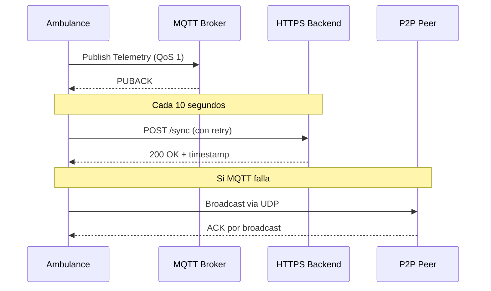

# 📚 Documentación Técnica - Sistema de Gemelos Digitales de Ambulancias

## 📖 Índice
1. [Arquitectura del Sistema](#arquitectura-del-sistema)
2. [Componentes Principales](#componentes-principales)
3. [Flujo de Datos](#flujo-de-datos)
4. [API Reference](#api-reference)
5. [Protocolos de Comunicación](#protocolos-de-comunicación)
6. [Estructura de Datos](#estructura-de-datos)
7. [Algoritmos y Lógica de Negocio](#algoritmos-y-lógica-de-negocio)
8. [Configuración y Despliegue](#configuración-y-despliegue)
9. [Mantenimiento y Monitoreo](#mantenimiento-y-monitoreo)
10. [Solución de Problemas](#solución-de-problemas)

## 🏗️ Arquitectura del Sistema

### Visión General
El sistema sigue una arquitectura de microservicios con separación clara de responsabilidades:

```
┌─────────────────────────────────────────────────────────────┐
│                    Frontend Dashboard                        │
│                (HTML/CSS/JS + WebSockets)                   │
└──────────────────────────┬──────────────────────────────────┘
                           │ WebSockets (Socket.io)
┌──────────────────────────▼──────────────────────────────────┐
│                 Backend FastAPI (app.py)                    │
│  ├── REST API Endpoints                                     │
│  ├── WebSocket Server                                       │
│  ├── State Broadcaster (10Hz)                               │
│  └── Static File Server                                     │
└──────────────────────────┬──────────────────────────────────┘
                           │ Internal Python Calls
┌──────────────────────────▼──────────────────────────────────┐
│              Simulator Engine (engine.py)                   │
│  ├── Ambulance Management                                   │
│  ├── Emergency Dispatch Logic                               │
│  ├── Simulation Control                                     │
│  └── Statistics Collection                                  │
└──────────────────────────┬──────────────────────────────────┘
                           │ Object Composition
┌──────────────────────────▼──────────────────────────────────┐
│              Ambulance Twins (twin/ambulance.py)            │
│  ├── Mechanical Engine (telemetry/mechanical.py)           │
│  ├── Vitals Engine (telemetry/vitals.py)                   │
│  ├── Logistics Engine (telemetry/logistics.py)             │
│  ├── MQTT Client (comms/mqtt_client.py)                    │
│  ├── HTTPS Client (comms/https_client.py)                  │
│  └── P2P Mesh (comms/p2p_mesh.py)                          │
└─────────────────────────────────────────────────────────────┘
```

### Patrones de Diseño Implementados

1. **Observer Pattern**: WebSockets notifican cambios de estado a clientes
2. **Strategy Pattern**: Diferentes motores de telemetría intercambiables
3. **Composite Pattern**: AmbulanceTwin compone múltiples motores
4. **Factory Pattern**: Creación de ambulancias y emergencias
5. **Singleton Pattern**: Motor de simulación único
6. **Publisher-Subscriber**: Comunicación MQTT y P2P
7. **Repository Pattern**: Gestión de datos de estado

## 🔧 Componentes Principales

### 1. Backend FastAPI (`app.py`)

#### Responsabilidades
- Servir API REST para operaciones del sistema
- Gestionar conexiones WebSocket en tiempo real
- Broadcast de estado de simulación (10Hz)
- Servir archivos estáticos del frontend
- Gestionar ciclo de vida de la aplicación

#### Características Clave
- **Async/Await**: Todas las operaciones son asíncronas
- **Type Hints**: Validación automática con Pydantic
- **CORS**: Habilitado para desarrollo
- **Lifespan Management**: Inicialización/limpieza adecuada
- **Error Handling**: Manejo centralizado de excepciones

#### Endpoints Principales
```python
# Health Check
GET /api/health → {"status": "healthy", "engine_running": bool}

# Gestión de Ambulancias
GET /api/ambulances → Lista todas las ambulancias
GET /api/ambulances/{id} → Detalles específicos
POST /api/spawn → Crear nueva entidad

# Control de Simulación
POST /api/control/toggle → Play/Pause
POST /api/control/speed → Cambiar velocidad (1-20x)
POST /api/control/clear → Limpiar escenario

# Operaciones Médicas
POST /api/treatment/administer → Administrar tratamiento
POST /api/maintenance/perform → Realizar mantenimiento
```

### 2. Motor de Simulación (`engine.py`)

#### Responsabilidades
- Gestión centralizada de la flota de ambulancias
- Lógica de despacho de emergencias
- Control de velocidad de simulación
- Recolección de estadísticas
- Coordinación de redes de comunicación

#### Algoritmos Implementados

**Asignación de Emergencias**:
```python
def assign_emergency_to_ambulance(emergency):
    # 1. Filtrar ambulancias disponibles
    available = filter(lambda amb: 
        amb.has_patient == False and 
        amb.mechanical.fuel_level > 20 and
        not amb.has_incident('mechanical')
    )
    
    # 2. Calcular distancia a cada ambulancia
    distances = [(amb, haversine(emergency, amb.position)) 
                 for amb in available]
    
    # 3. Ordenar por distancia y prioridad
    sorted_amb = sorted(distances, 
        key=lambda x: (x[1], -x[0].operational_hours))
    
    # 4. Asignar a la más cercana y experimentada
    return sorted_amb[0][0] if sorted_amb else None
```

**Detección de Atascos**:
```python
def detect_traffic_jams():
    jams = []
    for amb1, amb2 in combinations(ambulances, 2):
        distance = haversine(amb1.position, amb2.position)
        speed1 = amb1.logistics.speed
        speed2 = amb2.logistics.speed
        
        # Dos ambulancias cercanas y lentas
        if (distance < 0.001 and  # ~100 metros
            speed1 < 5 and speed2 < 5):  # < 5 km/h
            jam_center = midpoint(amb1.position, amb2.position)
            jams.append(jam_center)
    
    return jams
```

### 3. Gemelo Digital de Ambulancia (`twin/ambulance.py`)

#### Estructura de Clase
```python
class AmbulanceTwin:
    def __init__(self, ambulance_id: str, log_callback=None):
        self.ambulance_id = ambulance_id
        self.running = True
        self.is_paused = False
        self.speed_multiplier = 1.0
        self.communication_errors = 0
        self.operational_hours = 0.0
        
        # Motores de telemetría
        self.mechanical = MechanicalEngine()
        self.vitals = VitalsEngine()
        self.logistics = LogisticsEngine()
        
        # Clientes de comunicación
        self.mqtt_client = None
        self.https_client = None
        self.p2p_mesh = None
        
        # Estado actual
        self.current_state = {}
        self.incidents = []
```

#### Ciclo de Vida
1. **Inicialización**: Configuración de motores y clientes
2. **Arranque**: Inicio de threads de simulación
3. **Ejecución**: Loop principal de actualización
4. **Shutdown**: Limpieza ordenada de recursos

### 4. Motores de Telemetría

#### Motor Mecánico (`telemetry/mechanical.py`)
**Métricas Monitoreadas**:
- Combustible (0-100%)
- Presión de neumáticos (28-35 PSI)
- Temperatura del motor (80-110°C)
- Temperatura de transmisión (70-100°C)
- Nivel de aceite (1-5)
- Estado de batería (0-100%)

**Diagnóstico Predictivo**:
```python
def predictive_maintenance_needed(self) -> bool:
    # Alertas tempranas basadas en tendencias
    if (self.fuel_consumption_rate > 0.15 or  # Consumo anormal
        self.tire_pressure_trend < -0.5 or     # Pérdida de presión
        self.engine_temp_variance > 10):       # Sobrecalentamiento
        return True
    return False
```

#### Motor de Constantes Vitales (`telemetry/vitals.py`)
**Métricas del Paciente**:
- Frecuencia cardíaca (60-100 bpm)
- Saturación de oxígeno (95-100%)
- Presión arterial (120/80 mmHg)
- Temperatura corporal (36-38°C)
- Frecuencia respiratoria (12-20 rpm)
- Nivel de dolor (0-10 escala)

**Sistema de Tratamientos**:
```python
TREATMENTS = {
    "oxygen": {"effect": "increase_spo2", "amount": 5, "duration": 30},
    "epinephrine": {"effect": "increase_hr", "amount": 20, "duration": 15},
    "fluids": {"effect": "stabilize_bp", "amount": 10, "duration": 45},
    "analgesia": {"effect": "reduce_pain", "amount": 3, "duration": 60}
}
```

#### Motor Logístico (`telemetry/logistics.py`)
**Funcionalidades**:
- Navegación GPS con OpenStreetMap
- Cálculo de rutas óptimas
- Detección de atascos en tiempo real
- Gestión de misiones y destinos
- Predicción de tiempo de llegada

**Algoritmo de Ruteo**:
```python
def calculate_route(self, destination):
    # Usar OSMnx para obtener grafo de la ciudad
    graph = get_city_graph()
    
    # Encontrar nodos más cercanos
    origin_node = ox.nearest_nodes(graph, self.lon, self.lat)
    dest_node = ox.nearest_nodes(graph, destination.lon, destination.lat)
    
    # Calcular ruta más corta (tiempo)
    route = nx.shortest_path(
        graph, 
        origin_node, 
        dest_node, 
        weight='travel_time'
    )
    
    # Convertir a geometría para visualización
    self.route_geometry = nodes_to_geometry(graph, route)
    self.route_step = 0
```

### 5. Módulos de Comunicación

#### Cliente MQTT (`comms/mqtt_client.py`)
**Configuración**:
```python
MQTT_CONFIG = {
    "broker": "localhost",
    "port": 1883,
    "keepalive": 60,
    "qos": 1,  # At least once delivery
    "retain": False,
    "topics": {
        "telemetry": "ambulance/{id}/telemetry",
        "incidents": "ambulance/{id}/incidents",
        "commands": "ambulance/{id}/commands"
    }
}
```

**Características**:
- Reconexión automática con backoff exponencial
- Compresión de mensajes (gzip)
- Validación de schema JSON
- Estadísticas de transmisión
- Manejo de QoS

#### Cliente HTTPS (`comms/https_client.py`)
**Endpoints del Backend**:
```python
HTTPS_ENDPOINTS = {
    "sync": "/api/sync",
    "emergency": "/api/emergency",
    "health": "/api/health",
    "backup": "/api/backup"
}
```

**Mecanismos de Resiliencia**:
- Reintentos con exponential backoff (1s, 2s, 4s, 8s)
- Timeout adaptativo (2-30 segundos)
- Circuit breaker pattern
- Cache de fallos
- Validación de respuestas

#### Red P2P Mesh (`comms/p2p_mesh.py`)
**Protocolo de Mensajes**:
```python
P2P_MESSAGE_TYPES = {
    "HELLO": 1,      # Anuncio de presencia
    "TELEMETRY": 2,  # Datos de telemetría
    "INCIDENT": 3,   # Reporte de incidente
    "EMERGENCY": 4,  # Alerta de emergencia
    "ACK": 5         # Confirmación
}
```

**Algoritmo de Descubrimiento**:
1. Broadcast UDP en puerto 5005
2. Escucha de mensajes HELLO
3. Mantenimiento de lista de vecinos
4. Heartbeat cada 30 segundos
5. Limpieza de vecinos inactivos (>90 segundos)

## 🔄 Flujo de Datos

### Flujo Normal de Operación
```
AmbulanceTwin ────[1Hz]───▶ MQTT ────▶ Central Server
        │                           │
        │                           │
        ├───[10Hz]──▶ P2P Mesh ←───┘
        │           (vecinos cercanos)
        │
        └───[10s]──▶ HTTPS ────▶ Backup DB
```

### Secuencia de Sincronización


### Procesamiento de Incidentes
1. **Detección**: Motor identifica anomalía
2. **Clasificación**: Severidad (LOW, MEDIUM, HIGH, CRITICAL)
3. **Notificación**: Envío inmediato vía MQTT
4. **Escalación**: Si no hay ACK en 5s, usar HTTPS
5. **Broadcast**: Si ambas fallan, usar P2P
6. **Registro**: Log local y backup

## 📡 Protocolos de Comunicación

### MQTT (Message Queuing Telemetry Transport)

**Topics Structure**:
```
ambulance/{ambulance_id}/{data_type}/{timestamp}
```

**Message Format**:
```json
{
  "timestamp": "2024-01-15T10:30:00Z",
  "ambulance_id": "AMB-001",
  "data_type": "telemetry|incident|status",
  "payload": {
    "mechanical": {...},
    "vitals": {...},
    "logistics": {...}
  },
  "sequence": 12345,
  "checksum": "a1b2c3d4e5"
}
```

**Quality of Service**:
- QoS 0: At most once (telemetría de baja prioridad)
- QoS 1: At least once (datos médicos críticos)
- QoS 2: Exactly once (configuraciones importantes)

### HTTPS REST API

**Request Headers**:
```http
POST /api/sync HTTP/1.1
Host: localhost:8000
Content-Type: application/json
X-Ambulance-ID: AMB-001
X-Sequence-Number: 12345
X-Timestamp: 2024-01-15T10:30:00Z
```

**Response Format**:
```json
{
  "status": "success|error",
  "timestamp": "2024-01-15T10:30:01Z",
  "data": {
    "sync_id": "sync_abc123",
    "next_sync_in": 10,
    "emergencies": [...],
    "commands": [...]
  },
  "error": null
}
```

### P2P UDP Protocol

**Packet Structure**:
```
0                   1                   2                   3
0 1 2 3 4 5 6 7 8 9 0 1 2 3 4 5 6 7 8 9 0 1 2 3 4 5 6 7 8 9 0 1
+-+-+-+-+-+-+-+-+-+-+-+-+-+-+-+-+-+-+-+-+-+-+-+-+-+-+-+-+-+-+-+-+
|   Version    |    Type       |          Sequence Number       |
+-+-+-+-+-+-+-+-+-+-+-+-+-+-+-+-+-+-+-+-+-+-+-+-+-+-+-+-+-+-+-+-+
|                         Timestamp                             |
+-+-+-+-+-+-+-+-+-+-+-+-+-+-+-+-+-+-+-+-+-+-+-+-+-+-+-+-+-+-+-+-+
|                      Source Ambulance ID                      |
+-+-+-+-+-+-+-+-+-+-+-+-+-+-+-+-+-+-+-+-+-+-+-+-+-+-+-+-+-+-+-+-+
|                    Destination Ambulance ID                   |
+-+-+-+-+-+-+-+-+-+-+-+-+-+-+-+-+-+-+-+-+-+-+-+-+-+-+-+-+-+-+-+-+
|                         Payload Length                        |
+-+-+-+-+-+-+-+-+-+-+-+-+-+-+-+-+-+-+-+-+-+-+-+-+-+-+-+-+-+-+-+-+
|                         Payload Data...                       |
+-+-+-+-+-+-+-+-+-+-+-+-+-+-+-+-+-+-+-+-+-+-+-+-+-+-+-+-+-+-+-+-+
```

## 🗄️ Estructura de Datos

### Estado de Ambulancia
```python
@dataclass
class AmbulanceState:
    # Identificación
    ambulance_id: str
    timestamp: datetime
    
    # Posición
    position: LatLon
    speed: float  # km/h
    heading: float  # grados
    
    # Estado mecánico
    mechanical: MechanicalState
    
    # Estado del paciente
    vitals: VitalsState
    
    # Estado logístico
    logistics: LogisticsState
    
    # Comunicaciones
    communications: CommunicationsState
    
    # Incidentes activos
    active_incidents: List[Incident]
    
    # Métricas de rendimiento
    metrics: PerformanceMetrics
```

### Estado Mecánico
```python
@dataclass
class MechanicalState:
    fuel_level: float  # 0-100%
    tire_pressure: Dict[str, float]  # FL, FR, RL, RR
    engine_temperature: float  # °C
    transmission_temperature: float  # °C
    oil_level: int  # 1-5
    battery_level: float  # 0-100%
    maintenance_needed: bool
    diagnostics: List[DiagnosticCode]
```

### Estado del Paciente
```python
@dataclass
class VitalsState:
    heart_rate: int  # bpm
    oxygen_saturation: float  # %
    blood_pressure: BloodPressure  # systolic/diastolic
    body_temperature: float  # °C
    respiratory_rate: int  # rpm
    pain_level: int  # 0-10
    consciousness: str  # ALERT, CONFUSED, UNRESPONSIVE
    treatments_administered: List[Treatment]
    patient_age: int
    has_patient: bool
    patient_status: str  # STABLE, SERIOUS, CRITICAL
```

### Estado Logístico
```python
@dataclass
class LogisticsState:
    current_mission: Optional[Mission]
    destination: Optional[LatLon]
    destination_type: str  # BASE, EMERGENCY, PATROL, HOSPITAL
    route_geometry: List[LatLon]
    route_step: int
    total_route_steps: int
    estimated_arrival: datetime
    traffic_conditions: float  # 0-1 (0=libre, 1=congestionado)
    in_jam: bool
    jam_severity: float  # 0-1
```

## ⚙️ Configuración y Despliegue

### Variables de Entorno
```bash
# Servidor FastAPI
FASTAPI_HOST=0.0.0.0
FASTAPI_PORT=5000
FASTAPI_RELOAD=False
FASTAPI_LOG_LEVEL=info

# MQTT Broker
MQTT_BROKER=localhost
MQTT_PORT=1883
MQTT_USERNAME=
MQTT_PASSWORD=

# HTTPS Backend
HTTPS_BASE_URL=http://localhost:8000
HTTPS_TIMEOUT=30
HTTPS_RETRIES=3

# P2P Network
P2P_PORT=5005
P2P_BROADCAST_INTERVAL=30
P2P_TIMEOUT=90

# Simulación
SIMULATION_SPEED_MULTIPLIER=1.0
SIMULATION_UPDATE_INTERVAL=0.1
MAX_AMBULANCES=50
```

### Despliegue con Docker
```dockerfile
FROM python:3.10-slim

WORKDIR /app

COPY requirements.txt .
RUN pip install --no-cache-dir -r requirements.txt

COPY . .

EXPOSE 5000

CMD ["uvicorn", "app:app", "--host", "0.0.0.0", "--port", "5000"]
```

### Despliegue en Kubernetes
```yaml
apiVersion: apps/v1
kind: Deployment
metadata:
  name: ambulance-digital-twin
spec:
  replicas: 3
  selector:
    matchLabels:
      app: ambulance-digital-twin
  template:
    metadata:
      labels:
        app: ambulance-digital-twin
    spec:
      containers:
      - name: app
        image: ambulance-digital-twin:latest
        ports:
        - containerPort: 5000
        env:
        - name: FASTAPI_HOST
          value: "0.0.0.0"
        - name: FASTAPI_PORT
          value: "5000"
        resources:
          requests:
            memory: "256Mi"
            cpu: "250m"
          limits:
            memory: "512Mi"
            cpu: "500m"
```

## 📊 Mantenimiento y Monitoreo

### Métricas Clave (KPIs)

1. **Disponibilidad del Sistema**
   - Uptime: > 99.9%
   - Tiempo de respuesta API: < 100ms
   - Tasa de éxito de sincronización: > 99.5%

2. **Rendimiento de Comunicaciones**
   - Latencia MQTT: < 1 segundo
   - Tasa de éxito HTTPS: > 99%
   - Vecinos P2P detectados: 2-5 por ambulancia

3. **Calidad del Servicio**
   - Tiempo medio de respuesta a emergencias: < 8 minutos
   - Tasa de falsos positivos en incidentes: < 5%
   - Precisión de ruteo: > 95%

### Logs y Auditoría

**Estructura de Logs**:
```
logs/
├── ambulance_simulation.log     # Log principal
├── mqtt_client.log             # Comunicaciones MQTT
├── https_client.log            # Sincronizaciones HTTPS
├── p2p_mesh.log               # Red P2P
└── audit_trail.log            # Auditoría de operaciones
```

**Formato de Log**:
```json
{
  "timestamp": "2024-01-15T10:30:00.123Z",
  "level": "INFO",
  "logger": "ambulance.AMB-001",
  "message": "Telemetry sent successfully",
  "data": {
    "sequence": 12345,
    "bytes": 1024,
    "destination": "mqtt://localhost:1883"
  },
  "correlation_id": "corr_abc123"
}
```

### Health Checks

**Endpoints de Monitoreo**:
```python
# Health check básico
GET /api/health → {"status": "healthy", "components": {...}}

# Health check detallado
GET /api/health/detailed → {
  "api": {"status": "up", "response_time": 12},
  "mqtt": {"status": "connected", "latency": 0.5},
  "database": {"status": "reachable", "size_mb": 125},
  "simulation": {"status": "running", "ambulances": 3}
}

# Métricas Prometheus
GET /metrics → formato Prometheus
```

## 🔧 Solución de Problemas

### Problemas Comunes y Soluciones

#### 1. MQTT Connection Issues
**Síntomas**: 
- "Connection refused" en logs
- Telemetría no llega al dashboard

**Solución**:
```bash
# Verificar que Mosquitto esté corriendo
sudo systemctl status mosquitto

# Probar conexión manual
mosquitto_sub -h localhost -t "ambulance/#" -v

# Reiniciar servicio
sudo systemctl restart mosquitto
```

#### 2. HTTPS Sync Failures
**Síntomas**:
- "Connection timeout" en logs
- Datos no se sincronizan con backend

**Solución**:
```bash
# Verificar que el backend esté corriendo
curl http://localhost:8000/api/health

# Verificar conectividad de red
ping localhost
telnet localhost 8000

# Revisar configuración HTTPS
cat .env | grep HTTPS
```

#### 3. P2P Network Not Discovering Peers
**Síntomas**:
- "No peers detected" en logs
- Ambulancias aisladas en mapa

**Solución**:
```bash
# Verificar que el puerto UDP esté abierto
netstat -an | grep 5005

# Probar broadcast manual
python -c "import socket; s=socket.socket(socket.AF_INET,socket.SOCK_DGRAM); s.setsockopt(socket.SOL_SOCKET,socket.SO_BROADCAST,1); s.sendto(b'TEST',('255.255.255.255',5005))"

# Verificar firewall
sudo ufw status
```

#### 4. Dashboard No Loading
**Síntomas**:
- Página en blanco
- Errores en consola del navegador

**Solución**:
```bash
# Verificar que FastAPI esté sirviendo archivos estáticos
curl http://localhost:5000/

# Verificar permisos de archivos
ls -la static/

# Revisar logs del servidor
tail -f ambulance_simulation.log
```

### Debugging Avanzado

#### Habilitar Debug Logging
```python
import logging
logging.basicConfig(level=logging.DEBUG)

# O en la línea de comandos
python app.py --log-level debug
```

#### Profiling de Performance
```python
import cProfile
import pstats

profiler = cProfile.Profile()
profiler.enable()

# Ejecutar código a profilear
run_simulation()

profiler.disable()
stats = pstats.Stats(profiler).sort_stats('cumulative')
stats.print_stats(20)  # Top 20 funciones
```

#### Memory Leak Detection
```python
import tracemalloc

tracemalloc.start()

# ... ejecutar código ...

snapshot = tracemalloc.take_snapshot()
top_stats = snapshot.statistics('lineno')

for stat in top_stats[:10]:
    print(stat)
```

## 🚀 Optimizaciones y Mejoras Futuras

### Optimizaciones Implementadas

1. **Caching de Grafos de Ciudad**: Pre-carga en background
2. **Compresión de Mensajes**: gzip para telemetría grande
3. **Batch Processing**: Agrupación de actualizaciones
4. **Connection Pooling**: Reutilización de conexiones HTTP
5. **Lazy Loading**: Carga bajo demanda de componentes

### Roadmap de Mejoras

#### Fase 1 (Inmediato)
- [ ] Integración con sistemas de emergencia reales
- [ ] Machine learning para predicción de atascos
- [ ] Dashboard móvil responsive
- [ ] Sistema de reportes automáticos

#### Fase 2 (Corto Plazo)
- [ ] Integración con wearables médicos
- [ ] Realidad aumentada para navegación
- [ ] Sistema de voz para comandos
- [ ] Analytics predictivo para mantenimiento

#### Fase 3 (Largo Plazo)
- [ ] Blockchain para trazabilidad médica
- [ ] Integración con drones de emergencia
- [ ] Sistema autónomo de toma de decisiones
- [ ] Plataforma multi-tenant para hospitales

### Consideraciones de Escalabilidad

#### Escalado Horizontal
```yaml
# Estrategia de sharding por región
regions:
  - name: madrid
    ambulances: 0-999
    broker: mqtt-madrid.example.com
    
  - name: barcelona
    ambulances: 1000-1999
    broker: mqtt-barcelona.example.com
```

#### Caching Distribuido
```python
# Usar Redis para estado compartido
import redis

cache = redis.Redis(
    host='redis-cluster.example.com',
    port=6379,
    decode_responses=True
)

def get_ambulance_state(ambulance_id):
    key = f"ambulance:{ambulance_id}:state"
    return cache.get(key) or fetch_from_database(ambulance_id)
```

## 📚 Referencias y Recursos

### Documentación Oficial
- [FastAPI Documentation](https://fastapi.tiangolo.com/)
- [Paho MQTT Documentation](https://www.eclipse.org/paho/)
- [OSMnx Documentation](https://osmnx.readthedocs.io/)
- [Socket.io Documentation](https://socket.io/docs/)

### Estándares Médicos
- HL7 FHIR para intercambio de datos médicos
- DICOM para imágenes médicas
- IEEE 11073 para dispositivos médicos
- HIPAA para privacidad de datos

### Patrones de Arquitectura
- [Microservices Patterns](https://microservices.io/patterns/)
- [Event-Driven Architecture](https://aws.amazon.com/event-driven-architecture/)
- [CQRS Pattern](https://docs.microsoft.com/en-us/azure/architecture/patterns/cqrs)
- [Saga Pattern](https://microservices.io/patterns/data/saga.html)

### Herramientas Recomendadas
- **Monitoring**: Prometheus + Grafana
- **Logging**: ELK Stack (Elasticsearch, Logstash, Kibana)
- **Testing**: pytest, locust (load testing)
- **CI/CD**: GitHub Actions, Jenkins
- **Containerization**: Docker, Kubernetes

---

**Última Actualización**: Enero 2024  
**Versión del Documento**: 2.0.0  
**Mantenedor**: Equipo de Desarrollo HPE Ambulancia Digital Twin