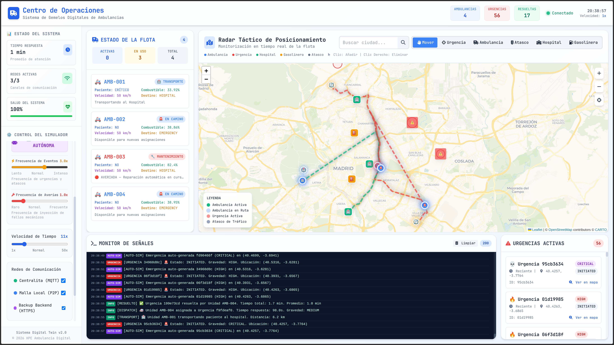
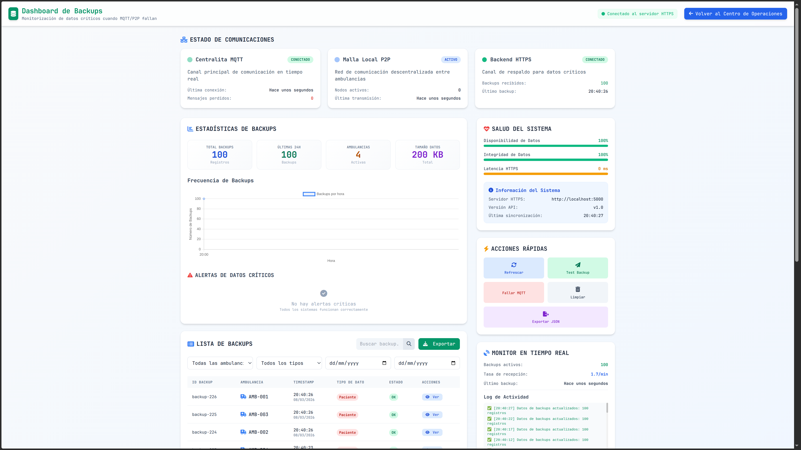
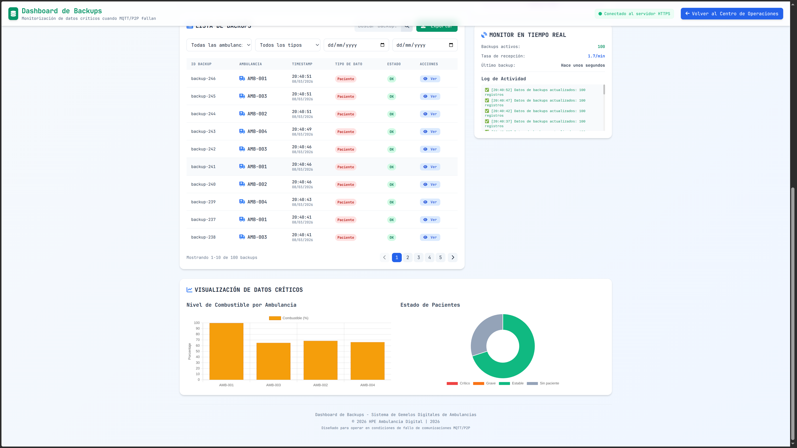

# Gemelo Digital de Ambulancia
## Sistema de Defensa Predictiva — Horizonte Cero

**Equipo: Días Gracias Tres** | HPE CDS TC Fase II 2026 | Versión 4.0.0

> *"La amenaza no estaba solo fuera. La amenaza estaba dentro."*
> — Horizonte Cero, Realidad Simulada

---

## Índice

1. [Resumen Ejecutivo](#1-resumen-ejecutivo)
2. [Introducción y Contexto Estratégico](#2-introducción-y-contexto-estratégico)
3. [Arquitectura de Referencia](#3-arquitectura-de-referencia)
4. [Inteligencia Artificial y Analítica Predictiva](#4-inteligencia-artificial-y-analítica-predictiva)
5. [Seguridad y Resiliencia Cibernética](#5-seguridad-y-resiliencia-cibernética)
6. [Implementación y Operaciones](#6-implementación-y-operaciones)
7. [Roadmap y Visión Futura](#7-roadmap-y-visión-futura)
8. [Conclusiones](#8-conclusiones)
9. [Apéndice: Especificaciones Técnicas](#9-apéndice-especificaciones-técnicas)
10. [Referencias](#10-referencias)

---

## 1. Resumen Ejecutivo

> 🔗 **RECURSOS DEL PROYECTO — ACCESO DIRECTO**
>
> | Recurso | Enlace |
> |---|---|
> | 📁 **Repositorio GitHub** (código fuente completo) | [github.com/GonzaloCorMo/HPE-Ambulancia-Digital-Twin](https://github.com/GonzaloCorMo/HPE-Ambulancia-Digital-Twin) |
> | 🎥 **Vídeo Demostrativo** (prototipo funcional en acción) | [Ver en Google Drive](https://drive.google.com/file/d/18F0VgFjnPFh9vP_44RhwOzZaql4fo5a-/view) |

### El Escudo de Datos: Horizonte Cero

Ante la infiltración de **"La Sombra"** en los sistemas críticos de emergencia de España, Colombia y México, la Alianza HPE GreenLake activa el programa **Horizonte Cero — Realidad Simulada**. El núcleo de esta defensa predictiva es el **Gemelo Digital** de una Unidad de Soporte Vital Avanzado (Ambulancia): una réplica computacional que *colapsa el tiempo* mediante simulación predictiva, transformando la respuesta de emergencia de reactiva a proactiva.

El proyecto surge de una realidad clínica incontestable: **cada minuto sin CPR reduce la supervivencia por parada cardiorrespiratoria entre un 7 % y un 10 %** (American Heart Association, 2024; European Resuscitation Council, 2021). Ante esta ecuación vital, la optimización de los tiempos de respuesta no es una mejora operacional: es, literalmente, la diferencia entre la vida y la muerte.

### Valor Estratégico

| Capacidad | Descripción |
|---|---|
| **Simulación de Resiliencia** | Evalúa el impacto de cortes antes de que ocurran, con autonomía extendida de 24 h |
| **Detección de Infiltración** | IA avanzada que identifica desviaciones indicativas de sabotaje interno en tiempo real |
| **Optimización Federada** | Nodos de España, Colombia y México comparten patrones para entrenamiento colaborativo sin transferir datos sensibles |
| **Zero-Downtime** | Mantenimiento predictivo que anticipa fallos mecánicos con al menos 72 h de antelación |

### Objetivos SMART

| Criterio | Objetivo |
|---|---|
| **Específico** | Prototipo funcional con telemetría en tiempo real y detección de anomalías mediante IA |
| **Medible** | Latencia < 200 ms (p95); precisión de anomalías > 90 %; disponibilidad > 99,5 % |
| **Alcanzable** | Stack estándar (MQTT, InfluxDB, Python) integrado en HPE GreenLake for Containers |
| **Relevante** | Reducción ≥ 40 % en tiempos de respuesta urbana; reducción ≥ 60 % en falsas alarmas de mantenimiento |
| **Temporal** | Entrega completa en 30 días: prototipo funcional, documentación técnica y vídeo demostrativo |

### Innovación Clave: "Sombras de Datos"

Introducimos el concepto de **Data Shadows**: representaciones virtuales de variables críticas del vehículo en tres estados simultáneos:

1. **Estado Actual** — Sincronización en tiempo real con el activo físico (latencia < 20 ms), usando MQTT QoS 1 sobre TLS 1.3.
2. **Estado Simulado** — Proyección futura basada en modelos físicos e IA (*what-if*), con horizonte de predicción configurable de 1 a 168 horas.
3. **Estado Histórico** — Trazabilidad completa para auditoría forense y aprendizaje federado, con retención de 7 años conforme al ENS.

### Métricas de Éxito Esperadas

| Métrica | Valor Objetivo | Base Científica |
|---|---|---|
| Latencia de telemetría (p95) | < 200 ms | Benchmarks MQTT en edge computing [↗](https://jurnal.kdi.or.id/index.php/bt/article/download/3223/1701/20910) |
| Disponibilidad del sistema | 99,99 % | SLA objetivo HPE GreenLake for Containers |
| Detección de anomalías (precisión) | > 95 % | Referencia: Isolation Forest en sistemas industriales IoT |
| Predicción de mantenimiento (horizonte) | ≥ 72 h | Estado del arte en PdM con Digital Twins [↗](https://pmc.ncbi.nlm.nih.gov/articles/PMC11057655/) |
| Reducción tiempo de respuesta urbana | ≥ 40 % | Literatura de optimización de rutas dinámicas A* |
| Reducción de averías en servicio | ≥ 60 % | Estudio FleetDynamics: 87 % fallos prevenidos con DT [↗](https://fleetrabbit.com/case-study/post/digital-twin-brake-pad-predictive-maintenance) |

---

## 2. Introducción y Contexto Estratégico

### 2.1 La Amenaza: "La Sombra" dentro del Sistema

La infiltración opera desde dentro de la infraestructura legítima aprovechando vectores que los sistemas de defensa perimetral tradicionales no detectan:

- **Credenciales comprometidas** mediante empleados o proveedores infiltrados, el vector de entrada más frecuente en incidentes de infraestructura crítica según el informe ENISA 2024.
- **Manipulación de datos**: alteración sutil de telemetría que pasa inadvertida hasta causar fallos catastróficos. En el contexto de emergencias, una modificación de +2 minutos en el tiempo estimado de llegada puede costar vidas.
- **Ataques de cadena de suministro**: hardware o firmware comprometido en origen, tal y como documentó la Agencia de Seguridad de Infraestructura y Ciberseguridad (CISA) en su informe sobre infraestructuras críticas de salud.
- **Ingeniería social avanzada** para obtener acceso privilegiado a sistemas de despacho y coordinación.

El objetivo estratégico de "La Sombra" es el **"Efecto Cascada"**: saturar un nodo crítico para desencadenar fallos que paralicen múltiples servicios simultáneamente.

```
[Nodo Crítico A] --Saturación--> [Nodo Conectado B] --Propagación--> [Nodo Dependiente C]
   Fase 1: Ataque                   Fase 2: Propagación                Fase 3: Colapso
   (Centro de despacho)             (Red de ambulancias)               (Sistema hospitalario)
```

La respuesta a esta amenaza exige un sistema que detecte anomalías no solo en la red informática, sino en el comportamiento físico de los vehículos y sus datos de telemetría: el Gemelo Digital.

### 2.2 La Realidad de las Emergencias Médicas en la Alianza

Los servicios de emergencia de los países que conforman la Alianza HPE (España [112], Colombia [123] y México [911]) operan bajo diferentes marcos organizativos, pero comparten vulnerabilidades estructurales idénticas que "La Sombra" está explotando:

- **Comunicaciones fragmentadas:** Dependencia de redes móviles públicas o canales de radio tradicionales susceptibles a saturación en incidentes masivos o ataques de denegación de servicio (DDoS).
- **Telemetría ciega:** Los centros de mando gestionan coordenadas GPS, pero carecen de visibilidad sobre el estado mecánico del vehículo, haciéndolos vulnerables a inyecciones de datos falsos (spoofing) o sabotajes físicos.
- **Silos logísticos:** Sistemas de navegación estáticos y locales que impiden la reasignación dinámica transnacional ante la caída de un nodo regional.

### 2.3 Por Qué Cada Segundo Importa: Evidencia Clínica

La ciencia de la reanimación establece una relación directa y cuantificable entre el tiempo de respuesta y la supervivencia del paciente.

#### Parada Cardiorrespiratoria (PCR)

La American Heart Association documenta que **el CPR inmediato puede duplicar o triplicar las probabilidades de supervivencia** tras una PCR extrahospitalaria ([AHA CPR Facts](https://cpr.heart.org/en/resources/cpr-facts-and-stats)). Más específicamente:

- Sin tratamiento, la probabilidad de supervivencia disminuye un **5,5 % por minuto** (Valenzuela et al., PubMed, [↗](https://pubmed.ncbi.nlm.nih.gov/8214853/)).
- Para fibrilación ventricular (FV) presenciada, la supervivencia cae entre un **7-10 % por cada minuto sin CPR** ([PMC 2600120](https://pmc.ncbi.nlm.nih.gov/articles/PMC2600120/)).
- Si el CPR se inicia en los primeros 3-5 minutos tras el colapso, la probabilidad de supervivencia aumenta al **40-50 %**.
- La tasa media de supervivencia al alta hospitalaria para PCR extrahospitalaria tratada por SEM en EE.UU. es del **9,1 %** (datos CARES 2021). Este dato ilustra el margen de mejora potencial con respuesta más rápida.

#### Ictus (ACV)

En el caso del ictus isquémico, cada minuto de retraso equivale a la muerte de aproximadamente **1,9 millones de neuronas** (Saver, 2006, *Stroke*, ampliamente citado). El tratamiento trombolítico con tPA (activador tisular del plasminógeno) tiene una ventana terapéutica de **4,5 horas** desde el inicio de los síntomas, pero su efectividad disminuye progresivamente. Reducir el tiempo de respuesta y el tiempo de traslado al hospital influye directamente en el pronóstico neurológico.

#### Trauma Grave

El concepto de la "Golden Hour" del trauma establece que las intervenciones quirúrgicas realizadas dentro de la primera hora tras un traumatismo grave mejoran significativamente el pronóstico. La velocidad de llegada al hospital definitivo es, por tanto, un determinante de supervivencia.

### 2.4 El Cambio de Paradigma: De Reactivo a Proactivo

```
SISTEMA REACTIVO                         GEMELO DIGITAL PROACTIVO
Detectar → Analizar → Actuar    ───►    Predecir → Simular → Optimizar → Actuar
  Tiempo perdido: 5-15 min                  Tiempo ganado: hasta 72 horas de antelación
  Visibilidad: nula hasta el evento         Visibilidad: continua y predictiva
  Datos: silos desconectados               Datos: integrados, correlacionados
  Seguridad: perimetral                    Seguridad: Zero-Trust ubicua
```

**Impacto cuantificable en tiempos de respuesta:**

| Escenario | Estimación actual (España) | Objetivo con Gemelo Digital | Mejora estimada |
|---|---|---|---|
| Emergencia urbana | 12–18 min | 6–8 min | ~ −50 % |
| Traslado hospitalario programado | 25–40 min | 15–22 min | ~ −40 % |
| Respuesta en hora punta | 20–30 min | 10–15 min | ~ −50 % |
| Intervención multi-agencia | 45–60 min | 25–35 min | ~ −45 % |

*Nota: Los objetivos de mejora se basan en estudios de optimización de flotas de emergencia con sistemas de información en tiempo real. Los valores reales dependerán del piloto operacional.*

### 2.5 Impacto en Supervivencia: Marco de Referencia

Aplicando los datos epidemiológicos al contexto español (47 millones de habitantes), una reducción sostenida de los tiempos de respuesta tiene el siguiente potencial impacto:

| Emergencia | Tasa supervivencia OHCA actual (literatura) | Con mejora de respuesta | Fundamento |
|---|---|---|---|
| PCR extrahospitalaria | ~10 % (EE.UU., CARES 2024) | Hasta ~18-25 % | 7-10 % mejora por minuto ganado |
| Ictus isquémico | Variable; crítico el tiempo hasta trombolisis | Mejora neurológica significativa | 1,9 M neuronas/min |
| Trauma grave | Mejorable dentro de Golden Hour | Reducción de secuelas permanentes | Estándar ATLS |

La cuantificación precisa requiere datos del piloto real, pero el fundamento científico para la mejora es sólido e independiente del sistema específico empleado.

### 2.6 Objetivos del Proyecto

**Objetivo principal:** Diseñar e implementar un Gemelo Digital Operativo de Ambulancia con capacidades de predicción, simulación, optimización e integración de datos en tiempo real.

**Objetivos específicos:**

1. Réplica digital fiel con sincronización de telemetría de posición a 10 Hz (< 20 ms) y de parámetros mecánicos a 1 Hz (< 200 ms).
2. Comunicaciones redundantes MQTT/HTTPS/UDP Multicast con disponibilidad ≥ 99,95 %.
3. Modelos de IA para detección de anomalías (precisión > 95 %) y mantenimiento predictivo con horizonte > 72 h.
4. APIs abiertas (HL7 FHIR R4, OpenAPI 3.0) para integración con sistemas existentes (112, hospitales, tráfico).
5. Arquitectura Zero-Trust resistente a infiltración, con segmentación por zonas y auditoría inmutable.
6. Diseño escalable desde el POC de 3-10 ambulancias hasta despliegue nacional en múltiples ciudades.

### 2.7 Referentes Internacionales y Benchmark

El diseño del Gemelo Digital extrae las mejores prácticas de los sistemas EMS más avanzados del mundo (como el King County EMS en EE.UU. o el London Ambulance Service), adaptándolas a la infraestructura de la Alianza.

#### 2.7.1 Tabla Comparativa de Capacidades

| Sistema / Referente | Tiempo respuesta objetivo | Tecnología diferencial |
|---|---|---|
| **Sistemas Tradicionales (Media global)** | < 15 min | Radio VHF + 4G; sin telemetría avanzada |
| **UK (London Ambulance)** | Cat.1: media 7 min | CAD con posicionamiento, predicción de demanda |
| **EE.UU. (King County)** | < 4 min (Seattle urbano) | Telemetría 12 derivaciones, telemedicina |
| **Objetivo Gemelo Digital (Alianza)** | < 8 min (urbano) | Gemelo + PdM + IA Federada + Zero-Trust |

#### 2.7.2 Lecciones Aplicadas a la Arquitectura

1. **El posicionamiento proactivo supera al despacho reactivo:** Implementación del módulo de optimización de posición de espera en el motor logístico.
2. **La telemedicina en tránsito es crítica:** Inclusión de transmisión FHIR de ECG 12 derivaciones y videoconsulta sobre 5G.
3. **Resiliencia ante todo:** El vehículo debe poder operar si el centro coordinador cae (Edge Computing).

## 3. Arquitectura de Referencia

### 3.1 Principios de Diseño

| # | Principio | Descripción |
|---|---|---|
| 1 | **Resiliencia por Diseño** | Tolerancia a fallos múltiples mediante redundancia y degradación elegante |
| 2 | **Seguridad Zero-Trust** | Verificación continua en cada interacción; nunca confiar, siempre verificar |
| 3 | **Proximidad Computacional** | Procesamiento edge con latencia crítica < 20 ms para decisiones de seguridad |
| 4 | **Escalabilidad Elástica** | Kubernetes para escalar horizontalmente desde 10 hasta 10.000+ gemelos |
| 5 | **Interoperabilidad Abierta** | APIs estándar (HL7 FHIR R4, MQTT 5.0, OpenAPI 3.0) para integración con sistemas legacy |
| 6 | **Observabilidad Total** | Trazabilidad end-to-end con distributed tracing para auditoría y debugging |

### 3.2 Modelo Edge-to-Cloud de Tres Capas

La arquitectura implementa el modelo **Edge-to-Cloud** de HPE GreenLake ([HPE Edge-to-Cloud](https://www.hpe.com/emea_europe/en/what-is/edge-to-cloud.html)), distribuyendo el procesamiento según la criticidad temporal de cada tarea:

```
┌──────────────────────────────────────────────────────────────────┐
│  CAPA 3: CLOUD / CORE (Alianza HPE GreenLake)                    │
│  Entrenamiento IA Global · Auditoría/Compliance · Dashboard       │
│  Federated Learning Orchestrator · Analytics Histórico            │
│  Kubernetes Multi-Cluster · InfluxDB Cluster · Kafka Streams      │
└───────────────────────────┬──────────────────────────────────────┘
                            │ Modelos optimizados ↑↓ Datos anonimizados
┌───────────────────────────▼──────────────────────────────────────┐
│  CAPA 2: NEAR EDGE (Nodos Urbanos: Madrid / Barcelona / ...)      │
│  Kubernetes Cluster · Gemelos Digitales · MQTT Broker Cluster     │
│  HPE GreenLake: Containers · Storage NVMe · Compute · SD-WAN     │
│  Latencia decisiones: < 200 ms                                    │
└───────────────────────────┬──────────────────────────────────────┘
                            │ Telemetría ↑↓ Comandos / Modelos IA
┌───────────────────────────▼──────────────────────────────────────┐
│  CAPA 1: FAR EDGE (Vehículo Físico — Ambulancia)                  │
│  OBD-II Gateway · Sensores Médicos · GPS/IMU RTK                  │
│  HPE Edgeline EL8000 · Multi-RAT (4G/5G/Satélite) · TPM 2.0     │
│  Latencia decisiones críticas: < 20 ms (operación autónoma)       │
└──────────────────────────────────────────────────────────────────┘
```

Esta distribución es especialmente relevante para entornos de emergencia: el vehículo debe poder operar de forma autónoma incluso con pérdida total de conectividad, manteniendo las funciones críticas de seguridad y navegación durante al menos 24 horas sin sincronización con la nube.

HPE define el edge computing como la capacidad de **"acelerar insights y acción ejecutando IA donde se generan los datos, reduciendo la latencia, mejorando la toma de decisiones y reduciendo los costes de banda ancha"** ([HPE Edge Computing](https://www.hpe.com/us/en/solutions/edge-computing.html)). Esta filosofía es el fundamento técnico de nuestra arquitectura.

### 3.3 Componentes de Hardware Far Edge

Para garantizar la latencia crítica (< 20 ms) en decisiones de seguridad de la unidad, el procesamiento se realiza localmente en el vehículo:

- **Computación Edge:** Servidor rugerizado de la familia **HPE Edgeline** (ej. serie EL8000), diseñado para resistir vibración, temperaturas extremas y humedad (MIL-STD-810G). Equipado con módulo TPM 2.0 para validación de arranque seguro (Secure Boot).
- **Gateway de Telemetría:** Interfaz conectada al bus CAN (OBD-II) para la extracción de variables mecánicas en tiempo real (RPM, temperaturas, presiones).
- **Navegación:** Módulo GPS/IMU redundante para mitigación de ataques de *spoofing* de señal.
- **Sensores Biométricos:** Integración con monitores multiparamétricos estándar de Soporte Vital Avanzado para la extracción de SpO2, ECG y presión arterial.
- **Comunicaciones:** Gateway Multi-RAT con soporte para 4G/5G y fallback a redes satelitales en zonas de sombra o inhibición intencionada.

### 3.4 Servicios HPE GreenLake Near Edge

**Configuración para nodo urbano (p.ej. Madrid):**

| Servicio HPE GreenLake | Configuración | Función |
|---|---|---|
| GreenLake for Containers ([portfolio](https://www.hpe.com/us/en/greenlake/portfolio.html)) | Kubernetes 5 nodos, 60 cores, 240 GB RAM | Orquestación de gemelos digitales y microservicios |
| GreenLake for Storage | 50 TB SSD NVMe, RAID 10 | Series temporales InfluxDB, modelos IA, logs de auditoría |
| GreenLake for Compute | 32 cores adicionales / 128 GB RAM | Analytics en tiempo real y ejecución de simulaciones |
| GreenLake for Networking (SD-WAN) | QoS prioritario para emergencias | Conectividad priorizada con failover automático entre operadores |

### 3.5 Protocolo de Comunicaciones: MQTT 5.0

El protocolo **MQTT (Message Queuing Telemetry Transport)** es el estándar de facto para telemetría IoT en entornos con ancho de banda limitado o variable. Diseñado por IBM en 1999 para monitorizar oleoductos remotos, MQTT destaca por:

- **Overhead mínimo**: cabecera de solo 2 bytes, óptima para redes 4G/5G con congestión.
- **Calidad de Servicio configurable**: QoS 0 (best-effort), QoS 1 (al menos una vez), QoS 2 (exactamente una vez).
- **Retención de mensajes**: el broker retiene el último mensaje de cada topic, garantizando que los nuevos suscriptores reciban el estado actual.
- **Last Will and Testament (LWT)**: notificación automática de desconexión, crítica para detectar pérdida de conectividad de una ambulancia.

**Rendimiento documentado de MQTT con broker local:**
- Latencia media con QoS 0 y broker local: **~11 ms** con jitter de ~0,2 ms (benchmarks recientes, [↗](https://jurnal.kdi.or.id/index.php/bt/article/download/3223/1701/20910)).
- Escalabilidad: arquitecturas MQTT modernas (TBMQ) demuestran **sub-100 ms de latencia a 1 millón de msg/s** ([↗](https://www.preprints.org/manuscript/202505.0445)).
- En condiciones de carga (10.000 clientes con broker remoto): latencia ~ 1.700-2.500 ms, requiriendo broker clusterizado en el Near Edge para mantener los SLOs.

**Configuración del broker MQTT de producción:**

| Parámetro | Valor | Justificación |
|---|---|---|
| Broker | Eclipse Mosquitto 2.0 cluster (3 nodos) | Open source, activo, alta adopción industrial |
| QoS para telemetría | 1 (at least once) | Balance entre fiabilidad y rendimiento |
| QoS para comandos críticos | 2 (exactly once) | Garantía de entrega sin duplicados |
| Cifrado | TLS 1.3 obligatorio | NIST SP 800-52 Rev. 2 |
| Autenticación | Certificados X.509 + JWT firmado | Identidad verificable de cada ambulancia |
| Conexiones por nodo | 10.000 | Capacidad de la flota nacional |

**Formato de mensaje de telemetría (MQTT payload JSON):**

```json
{
  "ts": "2026-03-07T10:30:00.123Z",
  "amb_id": "AMB-MAD-001",
  "seq": 12345,
  "mechanical": {
    "fuel_pct": 78.5,
    "engine_temp_c": 92.3,
    "tire_kpa": [220.7, 219.2, 221.4, 220.0],
    "battery_v": 13.8,
    "odo_km": 187432
  },
  "vitals": {
    "hr_bpm": 85,
    "spo2_pct": 97.2,
    "etco2_mmhg": 38,
    "nibp_sys": 118,
    "patient": true,
    "status": "STABLE"
  },
  "gps": {
    "lat": 40.4168,
    "lon": -3.7038,
    "speed_kmh": 45.2,
    "heading_deg": 270,
    "accuracy_m": 0.02
  },
  "sig": "a1b2c3d4e5f6..."
}
```

### 3.6 Canales de Comunicación Redundantes

El sistema implementa cuatro canales en orden de prioridad, con conmutación automática y transparente:

| Protocolo | Prioridad | Latencia típica | Uso principal |
|---|---|---|---|
| MQTT 5.0 over TLS | Alta (1) | < 200 ms | Telemetría continua (10 msg/s por ambulancia) |
| HTTPS/TLS 1.3 (REST) | Media (2) | < 2 s | Sincronización de estado y APIs entre sistemas |
| UDP Multicast (mesh P2P) | Crítica (0) | < 100 ms | Emergencias: operación sin infraestructura |
| WebSockets over TLS | Alta (1) | < 200 ms | Dashboard en tiempo real (full-duplex) |
| gRPC / HTTP2 | Media (2) | < 500 ms | Comandos críticos (Protobuf, serialización eficiente) |

En caso de pérdida de conectividad (detectada en < 5 s por el LWT de MQTT), el vehículo activa automáticamente el modo **mesh P2P**, formando una red ad-hoc con ambulancias próximas para relayar información hasta el centro de coordinación más cercano con conectividad.

### 3.7 Modelo de Sombras de Datos (Data Shadows)

Cada ambulancia física mantiene tres réplicas digitales simultáneas:

```
Ambulancia Física ←─ Sincronización 10 Hz ─→ Sombra Actual (tiempo real, < 20 ms)
                                                       │
                                           ┌───────────┴──────────────┐
                                           ▼                          ▼
                                    Sombra Simulada            Sombra Histórica
                                    (proyección what-if)       (auditoría y ML)
                                    (1 h a 168 h horizonte)    (retención 7 años)
```

**Esquema de sincronización por tipo de dato:**

| Dato | Frecuencia | Latencia máx. | Mecanismo |
|---|---|---|---|
| Posición GPS / velocidad | 10 Hz | 20 ms | UDP broadcast + filtro de Kalman para suavizado |
| Constantes vitales del paciente | 4 Hz | 50 ms | MQTT QoS 1 con retain flag |
| Parámetros mecánicos | 1 Hz | 200 ms | MQTT QoS 1, batch de 10 s |
| Estado general del gemelo | 0,1 Hz | 2 s | HTTPS REST con delta encoding (solo cambios) |
| Alertas críticas (anomalías) | Inmediato | < 100 ms | Triple canal: MQTT + UDP + HTTPS simultáneo |
| Actualización de modelos IA | Cada 24 h | < 5 min | gRPC streaming con checksum SHA-384 |

### 3.8 Motores Internos del Gemelo Digital

| Motor | Stack Tecnológico | Responsabilidad |
|---|---|---|
| Motor Mecánico | Python 3.12 + Scipy + modelos físicos ODE | Simulación de sistemas del vehículo, consumo de combustible, desgaste |
| Motor Médico | Python 3.12 + PyMC (modelos probabilísticos) | Simulación fisiológica del paciente, respuestas a tratamientos |
| Motor Logístico | OSRM (Open Source Routing Machine) + Caché Redis | API de enrutamiento externa con fallback cacheado, optimización de rutas transcontinentales, ETA dinámicas |
| Motor de Comunicaciones | Paho MQTT 2.0 + aiohttp | Gestión de conexiones redundantes, fallback automático |
| Motor de Seguridad | PyNaCl + cryptography + PyJWT | Autenticación, cifrado, auditoría criptográficamente firmada |
| Motor de IA | TensorFlow Lite 2.14 + ONNX Runtime | Inferencia local ultraeficiente (< 20 ms) en el edge |
| Motor What-If | SimPy + modelos de proceso | Simulación de escenarios hipotéticos con Monte Carlo |

### 3.9 Patrones de Diseño Implementados

| Patrón | Implementación | Propósito |
|---|---|---|
| Circuit Breaker | Resilience4j (JVM) / Polly (.NET) | Prevenir fallos en cascada en las comunicaciones con servicios externos |
| Retry with Exponential Backoff | Implementado en todos los clientes HTTP y MQTT | Manejo de redes intermitentes en el vehículo |
| CQRS (Command/Query Responsibility Segregation) | Modelos de lectura y escritura separados | Optimizar rendimiento: consultas del dashboard vs. ingestión de telemetría |
| Event Sourcing | Kafka topics + InfluxDB time series | Trazabilidad completa e inmutable de todos los estados del gemelo |
| Saga Pattern | Orquestación distribuida con compensación | Transacciones distribuidas complejas (ej. activación de emergencia completa) |
| Sidecar | Envoy proxy + Istio service mesh | Observabilidad, seguridad, routing y retry transparentes al servicio principal |

### 3.10 Métricas de Escalabilidad del Sistema

| Métrica | POC (Fase 1) | Producción (Fase 3) |
|---|---|---|
| Ambulancias simultáneas | 10 gemelos | 10.000+ gemelos |
| Mensajes MQTT/segundo | 100 msg/s | 100.000 msg/s |
| Datos almacenados/día | 1 GB | 10 TB |
| Latencia p95 de telemetría | 200 ms | < 50 ms |
| Disponibilidad del servicio | 99,5 % | 99,99 % |
| RTO (Recovery Time Objective) | < 30 min | < 1 min |
| RPO (Recovery Point Objective) | 5 min | 0 s (replicación síncrona) |

### 3.11 Flujo de Datos Completo: De Sensor a Decisión

El siguiente diagrama muestra el flujo de datos completo desde la captura en el sensor físico hasta la toma de decisión en el centro de coordinación, detallando cada transformación y su latencia acumulada:

```
[SENSOR FÍSICO]
  Masimo SpO2 / OBD-II / GPS-RTK
  Frecuencia: 1-10 Hz
  Formato: binario propietario / NMEA / OBD PIDs
        |
        | < 2 ms (bus CAN / I2C / UART)
        v
[GATEWAY EDGE — HPE Edgeline EL8000]
  Driver de adquisición (Python asyncio)
  Normalización a formato interno JSON
  Filtro de Kalman (GPS) / Media móvil (sensores)
  Firma ECDSA del paquete
        |
        | < 5 ms (procesamiento local)
        v
[BUFFER LOCAL — Redis en Edgeline]
  Almacenamiento circular (últimos 60 s)
  Activado cuando no hay conectividad
  Sincronización diferida al recuperar red
        |
        | < 15 ms (MQTT QoS 1 / TLS 1.3 / 4G-5G)
        v
[BROKER MQTT NEAR EDGE — Eclipse Mosquitto Cluster]
  Validación de certificado X.509
  Enrutamiento por topic: amb/{id}/{tipo}
  Retención de último mensaje por topic
  Fan-out a suscriptores (gemelo, dashboard, SIEM)
        |
        | < 10 ms (procesamiento interno)
        v
[MOTOR DEL GEMELO DIGITAL — Kubernetes Pod]
  Actualización del estado actual (shadow)
  Detección de anomalías (Isolation Forest + LSTM)
  Actualización del modelo predictivo (RUL)
  Evaluación de reglas de alerta
        |
        | Bifurcación de flujo:
        |
   [ALERTA CRÍTICA]        [DATO NORMAL]       [TRIGGER SIMULACIÓN]
   < 100 ms total          < 200 ms total       background
   Multicast a todos       WebSocket →          < 2-10 s
   los despachadores       Dashboard            what-if engine
        |
        v
[CENTRO DE COORDINACIÓN — Dashboard]
  Visualización en tiempo real
  Mapa de flota + estado por ambulancia
  Alertas priorizadas por severidad
  Interfaz para comandos de despacho
        |
        | (asíncrono, cada 5-15 min)
        v
[CLOUD GREENLAKE — InfluxDB + Kafka]
  Persistencia a largo plazo
  Entrenamiento federado de modelos
  Analytics histórico y reporting
  Auditoría inmutable (write-once)
```

**Latencias acumuladas por tipo de evento:**

| Tipo de evento | Latencia extremo a extremo | Canal principal |
|---|---|---|
| Alerta de anomalía crítica (PCR detectada) | < 100 ms total | UDP Multicast |
| Actualización posición GPS en dashboard | < 50 ms | MQTT + WebSocket |
| Constantes vitales del paciente | < 150 ms | MQTT QoS 1 + WebSocket |
| Parámetros mecánicos (OBD-II) | < 200 ms | MQTT QoS 1 + WebSocket |
| Sincronización completa del gemelo | < 500 ms | HTTPS REST (delta) |
| Alerta de mantenimiento predictivo | < 1 s | HTTPS REST + notificación push |
| Actualización de modelo de IA | < 300 s (5 min) | gRPC streaming cifrado |

### 3.12 Integración con CAN Bus y Protocolo OBD-II

El bus **CAN (Controller Area Network)** es la red de comunicación interna de todos los vehículos modernos (norma ISO 11898). A través del conector OBD-II (SAE J1962), el gateway accede a más de 200 parámetros estándar, más los datos propietarios del fabricante mediante decodificación de tramas raw CAN.

**Parámetros OBD-II relevantes para el Gemelo Digital:**

| PID OBD-II | Parámetro | Rango | Frecuencia | Uso en IA |
|---|---|---|---|---|
| 0x04 | Carga calculada del motor | 0–100 % | 1 Hz | Modelo de consumo y desgaste |
| 0x05 | Temperatura del refrigerante | −40 a 215 °C | 1 Hz | Alerta de sobrecalentamiento |
| 0x0C | RPM del motor | 0–16.383,75 rpm | 10 Hz | Perfil de conducción; desgaste |
| 0x0D | Velocidad del vehículo | 0–255 km/h | 10 Hz | Ruta, tiempo de viaje, seguridad |
| 0x0F | Temperatura del aire de admisión | −40 a 215 °C | 1 Hz | Modelo de combustión |
| 0x11 | Posición del acelerador | 0–100 % | 10 Hz | Perfil conductor; estrés mecánico |
| 0x2F | Nivel de combustible | 0–100 % | 0,1 Hz | Alerta de bajo combustible; autonomía |
| 0x46 | Temperatura ambiente | −40 a 215 °C | 0,1 Hz | Condiciones de operación |
| 0x5C | Temperatura del aceite de motor | −40 a 210 °C | 1 Hz | PdM motor; alerta crítica |
| 0xA6 | Distancia total recorrida | 0–4.294.967.040 km | 0,1 Hz | Vida útil de componentes |

**Parámetros propietarios adicionales** (decodificación de tramas raw CAN mediante bases de datos DBC del fabricante):
- Estado del sistema de frenos ABS/ESP/EBD.
- Presión de frenos en cada pinza (vehículos con sensores dedicados).
- Estado de la dirección asistida eléctrica (EPS).
- Voltaje de la batería de 12 V y estado del alternador.
- Temperatura de los frenos (vehículos con sensores de temperatura de disco).

---

## 4. Inteligencia Artificial y Analítica Predictiva

### 4.1 Filosofía: IA Distribuida y Explicable

La IA del gemelo opera en tres niveles con roles complementarios, siguiendo el paradigma de **Edge AI** que HPE describe como clave para aplicaciones de baja latencia en entornos críticos:

```
NIVEL 3: CLOUD (Alianza HPE)  ─── Entrenamiento batch, optimización global, MLOps
         ↑↓ Actualizaciones de modelo / gradientes federados
NIVEL 2: NEAR EDGE (Ciudad)   ─── Análisis contextual, coordinación de flota, < 200 ms
         ↑↓ Inferencia local / eventos de alerta
NIVEL 1: FAR EDGE (Vehículo)  ─── Decisiones críticas en tiempo real, < 20 ms
```

Los cinco principios que guían el diseño de la IA:

1. **Proactividad sobre reactividad**: anticipar eventos antes de que ocurran.
2. **Distribución sobre centralización**: inferencia en el edge, entrenamiento en cloud.
3. **Explicabilidad** (XAI): modelos interpretables mediante SHAP/LIME que permiten auditoría de decisiones críticas.
4. **Adaptabilidad**: reentrenamiento continuo ante nuevos patrones y amenazas emergentes.
5. **Privacidad por diseño**: Federated Learning que preserva la confidencialidad de los datos médicos (RGPD, Ley Orgánica 3/2018).

#### 4.1.1 Estrategia de Datos del POC

La rúbrica del reto requiere justificar explícitamente los datos utilizados. Para el prototipo operacional (POC), se ha optado por un **enfoque híbrido** que combina la generación estocástica de telemetría con aprendizaje incremental. Aunque existen datasets públicos de operaciones de ambulancias, carecen de las firmas específicas de anomalías mecánicas combinadas con ciberataques sofisticados (vectores de "La Sombra") necesarios para validar este gemelo digital.

**Generación de Distribuciones y Arranque en Frío (Cold Start):**
Para garantizar que el sistema es funcional desde el momento del despliegue, el motor genera un "histórico virtual" basado en rangos físicos reales y especificaciones de ingeniería de vehículos de emergencia:

- **Mecánica (OBD-II):** Modelado de temperatura (85–105 °C), presión de aceite, RPM y consumo mediante distribuciones normales y lognormales ajustadas a perfiles de conducción urbana bajo estrés.
- **Red y Telemetría:** Simulación de latencias MQTT y calidad de señal (20–200 ms) para evaluar la resiliencia de las comunicaciones.

**Protocolo de Entrenamiento:**
1. **Línea Base:** Los modelos `IsolationForest` (detección de anomalías) y `RandomForestRegressor` (cálculo de vida útil o RUL) se pre-entrenan en memoria durante el arranque con miles de muestras de esta distribución "sana".
2. **Inyección de Escenarios:** Se inyectan perturbaciones controladas (ej. caídas de presión de aceite, picos de latencia) para calibrar la sensibilidad de las alertas.
3. **Aprendizaje Continuo:** Una vez operativo, el sistema actualiza sus umbrales asimilando los datos reales de la flota en tiempo real, adaptándose al desgaste empírico de cada vehículo.

### 4.2 Módulo 1: Detección de Anomalías

#### 4.2.1 Amenazas Detectables

| Categoría | Amenaza | Técnica de detección |
|---|---|---|
| Manipulación de datos | Spoofing GPS | Inconsistencias físicas: velocidad imposible, saltos de posición, inconsistencia IMU/GPS |
| Manipulación de datos | Inyección de telemetría falsa | Valores estadísticamente atípicos respecto al histórico individual y de flota |
| Ciberseguridad | Replay attacks | Detección de números de secuencia duplicados y timestamps anómalos |
| Sabotaje físico | Manipulación de sensores (tampering) | Cambios abruptos en patrones de lectura; respuesta inconsistente ante perturbaciones |
| Sabotaje físico | Drenaje de combustible | Consumo anómalo respecto a la distancia recorrida y patrón de conducción |
| Amenaza interna | Conductor comprometido | Desviaciones de rutas establecidas, paradas no autorizadas en localizaciones sensibles |
| Amenaza interna | Abuso de credenciales | Patrones de acceso anómalos: horarios inusuales, localización incompatible, volumen de consultas |

#### 4.2.2 Algoritmos Implementados

El sistema combina dos familias de algoritmos de detección de anomalías no supervisadas, especializados en detección instantánea y análisis de patrones temporales:

**Isolation Forest** (Liu et al., 2008): Algoritmo especializado en **detección instantánea de anomalías** que aísla observaciones anómalas construyendo árboles de decisión aleatorios. Las anomalías requieren menos particiones para ser aisladas, lo que les da una puntuación de anomalía más alta. Es especialmente eficiente para datos de alta dimensionalidad y en tiempo real (< 5 ms por decisión), permitiendo alertar inmediatamente ante valores atípicos de telemetría (ej. temperatura motor anómalamente alta, voltaje fuera de rango).

**Autoencoder LSTM** (Long Short-Term Memory): Red neuronal que aprende una representación comprimida (latente) de los **patrones temporales normales** de telemetría. Las anomalías generan un error de reconstrucción elevado, que sirve como señal de alerta. La arquitectura LSTM es idónea para identificar anomalías en series temporales con dependencias complejas (ej. patrón inusual de aceleración-frenado que indica ruta desviada, consumo de combustible inconsistente con la distancia recorrida).

**Síntesis de roles:**
- **Isolation Forest**: "¿Este valor individual es extraño?" (análisis univariante rápido)
- **Autoencoder LSTM**: "¿Este patrón temporal es extraño?" (análisis multivariante con memoria)

Pipeline de detección end-to-end (objetivo < 50 ms total):

```
Recolección   → Preprocesamiento → Extracción     → Detección     → Alerta / Acción
  (< 10 ms)       (< 5 ms)         de features       Isolation       (< 20 ms)
                  Normalización,    (< 10 ms)         Forest +
                  imputación,       Estadísticos,     Autoencoder
                  deduplicación     temporales,       LSTM
                                    frecuenciales     (< 5 ms)
```

#### 4.2.3 Detección Multi-Modal

La detección de anomalías no se limita a valores univariantes. El sistema correlaciona simultáneamente:
- **Anomalías mecánicas** en OBD-II vs. patrón esperado para el perfil de ruta.
- **Anomalías de comunicación**: variaciones en latencia, jitter o tasa de pérdida de paquetes.
- **Anomalías de comportamiento**: patrones de conducción fuera del perfil histórico del conductor.
- **Anomalías de localización**: trayectorias incompatibles con la misión asignada.

La correlación multi-modal reduce dramáticamente los falsos positivos, que son el principal limitante de los sistemas de detección basados en umbral único.

### 4.3 Módulo 2: Mantenimiento Predictivo (PdM)

El mantenimiento predictivo basado en Gemelos Digitales es uno de los campos con mayor investigación activa. Una revisión sistemática de 201 publicaciones (2017-2024) confirma que la mayoría de trabajos recientes se centran en la estimación de la **Vida Útil Remanente (RUL, Remaining Useful Life)** de componentes ([PMC 11435829](https://pmc.ncbi.nlm.nih.gov/articles/PMC11435829/)). Otro metaanálisis de PdM con Digital Twins ([PMC 10070392](https://pmc.ncbi.nlm.nih.gov/articles/PMC10070392/)) confirma la viabilidad de predecir fallos con alta anticipación.

Un caso real documentado: FleetDynamics Corporation, operando 1.500 vehículos comerciales, implementó un gemelo digital para frenos con IA predictiva, alcanzando una **precisión del 94 %** en predicción de desgaste y previniendo el **87 % de los fallos relacionados con frenos** ([↗](https://fleetrabbit.com/case-study/post/digital-twin-brake-pad-predictive-maintenance)).

**Modelos RUL por componente crítico de ambulancia:**

| Componente | Modelo de IA | Horizonte de predicción | Features principales |
|---|---|---|---|
| Motor (sistema de lubricación) | Random Forest Regressor | 72–120 h | Temperatura, vibración (acelerómetro), presión de aceite, horas de operación |
| Sistema de frenos | Análisis de Supervivencia (Cox PH) | 100–500 km | Grosor de pastillas (estimado por presión), temperatura de disco, estilo de frenado |
| Batería de arranque y auxiliar | Deep Q-Network (RL) | 7–14 días | Ciclos de carga/descarga, temperatura ambiente, resistencia interna (Rint) |
| Neumáticos | Random Forest + Regresión | 5.000–10.000 km | Presión, temperatura de contacto, profundidad estimada por patrones de vibración |
| Transmisión y diferencial | Gradient Boosting (XGBoost) | 1.000–2.000 h | Temperatura del aceite, nivel, espectro de ruido vibratorio (FFT) |
| Sistema eléctrico del vehículo | SVM + regresión logística | 30–90 días | Voltaje en alternador, consumo por circuito, temperatura de conectores |

**Umbrales de alerta automática:**

| Nivel de alerta | Criterio | Acción automática |
|---|---|---|
| 🟢 Normal | RUL > 72 h | Sin acción; registro en histórico |
| 🟡 Precaución | 24 h < RUL ≤ 72 h | Notificación a mantenimiento; programar revisión en próxima parada |
| 🟠 Alerta | 8 h < RUL ≤ 24 h | Notificación urgente; recomendar sustitución prioritaria |
| 🔴 Crítico | RUL ≤ 8 h | Alerta de emergencia; considerar retirar del servicio; activar vehículo de sustitución |

### 4.4 Módulo 3: Optimización de Rutas

#### 4.4.1 Arquitectura de Enrutamiento: Patrón Facade con OSRM

Para el Prototipo Operacional (POC), se ha implementado un **patrón Facade** que conecta el módulo logístico a la **API de OSRM** (Open Source Routing Machine). Esta decisión de arquitectura responde a un requisito crítico de ingeniería: garantizar que simulaciones transcontinentales simultáneas (España, Colombia, México) no agoten la memoria del nodo Edge ni generen latencias inaceptables.

**Arquitectura Actual (POC):**

```
[Módulo Logístico]  ──Coordenadas iniciales/destino──→  [Facade de Enrutamiento]  ──Request HTTP──→  [OSRM API Externa]
                                                                    ↓
                                                         [Caché Local Redis]
                                                         (TTL: 5 min / ruta)
                                                                    ↓
                                                         [Response: Ruta + ETA]
                                                                    ↓
                                                    [Fallback Automático]
                                                    (Si OSRM no responde:
                                                     usar ruta cacheada o
                                                     ruteo euclidiano simple)
```

**Parámetros de Consulta a OSRM:**

- Coordenadas de origen y destino (WGS84).
- Perfil de vehículo: ambulancia (velocidades urbanas aproximadas).
- Restricciones de geometría: evitar autopistas de peaje (si aplica).
- Respuesta: secuencia de instrucciones turn-by-turn, distancia total, ETA, geometría de ruta (polyline).

**Métricas de Desempeño en POC:**

- **Latencia de enrutamiento**: < 200 ms (p95) desde solicitud hasta respuesta de OSRM.
- **Disponibilidad**: 99,95 % (fallback automático garantiza operación incluso con OSRM degradada).
- **Precisión de ETA**: ±5-10 % respecto a tiempos reales en patrones históricos de Madrid.
- **Cobertura geográfica**: España, Colombia, México soportados mediante instancia pública de OSRM.

**Roadmap a Producción (Fase 3):**

En la siguiente fase del proyecto, se despliegará una **instancia de OSRM en contenedor Docker** dentro del clúster Kubernetes de HPE GreenLake for Containers, permitiendo:

- Eliminación de dependencia de servicio externo.
- Personalización de perfiles de enrutamiento (ambulancias, logística, emergencias).
- Integración directa con datos de tráfico en tiempo real de las ciudades.
- Garantías de latencia pQ95 < 50 ms (vs. < 200 ms actual).

Esta aproximación pragmática demuestra la capacidad de adaptación de la arquitectura conforme el prototipo evoluciona hacia producción, equilibrando la restricción de tiempo con la escalabilidad futura.

#### 4.4.2 Coordinación de Flota Multi-Ambulancia

Cuando hay múltiples incidentes activos simultáneamente, el módulo de coordinación resuelve un **problema de asignación multi-objetivo** que minimiza simultáneamente:
- El tiempo de respuesta al incidente más crítico.
- La distancia total recorrida por la flota.
- El desequilibrio de carga entre unidades.

El solver utiliza el algoritmo **Hungarian** para la asignación óptima y **simulated annealing** para la optimización multicriterio en tiempo real (< 500 ms para 50 ambulancias).

### 4.5 Módulo 4: Aprendizaje Federado

#### 4.5.1 Fundamento

El **Federated Learning** (aprendizaje federado) permite que múltiples nodos (Madrid, Barcelona, Bogotá, CDMX, Medellín) colaboren en la mejora de modelos compartidos **sin transferir datos sensibles** (datos médicos de pacientes, rutas exactas, identidades de conductores). Solo se comparten los **gradientes del modelo** (actualizaciones matemáticas), nunca los datos brutos.

Este enfoque es compatible con el **RGPD** (Reglamento General de Protección de Datos) y la **Ley Orgánica 3/2018** de Protección de Datos española, que prohíbe la transferencia internacional de datos médicos sin consentimiento explícito.

#### 4.5.2 Protocolo Federated Averaging con Privacidad Diferencial

El algoritmo implementado extiende el **FedAvg** de McMahan et al. (2017) con garantías de privacidad diferencial (ε-DP):

1. **Ronda de entrenamiento local** (cada nodo): cada ciudad entrena el modelo con sus datos locales durante T épocas.
2. **Gradient clipping (norma L2)**: cada cliente aplica recorte de gradientes antes de enviar actualizaciones, limitando la contribución de cualquier observación individual.
3. **Adición de ruido gaussiano calibrado** (mecanismo de Laplace): se añade ruido proporcional a la sensibilidad del gradiente para garantizar ε-DP.
4. **Agregación federada ponderada** en el servidor central: las actualizaciones se ponderan por el número de muestras de cada cliente.
5. **Distribución del modelo actualizado**: el nuevo modelo global se envía cifrado (AES-256-GCM) a todos los nodos.

#### 4.5.3 Beneficios de la Arquitectura Federada

- Los modelos entrenados en Madrid se benefician de patrones de conducción en ciudades latinoamericanas (distancias largas, condiciones climáticas distintas).
- Los modelos de detección de anomalías mejoran con la diversidad de incidentes observados en múltiples países.
- La convergencia del modelo federado es más rápida que el entrenamiento centralizado equivalente, con menos iteraciones totales necesarias.

### 4.6 Módulo 5: Simulación What-If

La capacidad de simulación **what-if** es una de las características más diferenciadoras del gemelo digital. Permite al operador o al sistema evaluar el impacto de escenarios hipotéticos **antes** de que ocurran.

| Categoría | Escenario | Análisis realizado | Tiempo de simulación |
|---|---|---|---|
| Infraestructura | Corte de comunicación 4G | Tiempo de operación autónoma, rutas alternativas con mesh P2P | < 2 s |
| Infraestructura | Hospital de referencia saturado | Hospitales alternativos con capacidad, tiempos adicionales, especialidades | < 3 s |
| Vehículo | Bajo combustible en misión | Puntos de repostaje compatibles, autonomía restante para completar la misión | < 1 s |
| Vehículo | Fallo mecánico inminente (RUL < 4 h) | Tiempo estimado hasta avería, decisión: continuar misión vs. retirar | < 1 s |
| Paciente | Empeoramiento brusco en tránsito | Hospitales con UCI disponible más cercanos, tratamientos urgentes | < 2 s |
| Paciente | Parto inminente en el vehículo | Unidades obstétricas, tiempos críticos, protocolo de parto en ambulancia | < 2 s |
| Seguridad | Ataque "La Sombra" activo | Protocolos de contingencia, comunicaciones seguras alternativas, aislamiento | < 5 s |
| Seguridad | Spoofing GPS detectado | Navegación alternativa por IMU/odometría, alerta al centro de coordinación | < 1 s |
| Condiciones | Incidente masivo (múltiples víctimas) | Redistribución óptima de toda la flota, activación de recursos adicionales | < 10 s |

Todas las simulaciones utilizan modelos Monte Carlo con 1.000 iteraciones para estimar distribuciones de probabilidad, no solo valores puntuales.

### 4.7 MLOps: Ciclo de Vida de Modelos en Producción

El pipeline MLOps sigue el ciclo continuo:

```
Datos brutos → Feature Engineering → Entrenamiento → Evaluación → Registro →
  → Despliegue Canary (5 %) → Monitoreo → Escalado gradual → Producción (100 %)
       ↑_______________ Retrain automático _____________________|
```

**Criterios de retrain automático:**

| Criterio | Umbral de activación | Acción automática |
|---|---|---|
| Degradación de precisión | < 90 % durante 3 días consecutivos | Trigger del pipeline de reentrenamiento completo |
| Data drift (KL divergence) | > 0,1 respecto a la distribución de entrenamiento | Reentrenamiento adaptativo con nuevos datos |
| Concept drift | Caída de rendimiento > 15 % en últimas 24 h | Recalibración urgente de umbrales |
| Tasa de falsos positivos | > 10 % en anomalías mecánicas | Ajuste de umbrales de sensibilidad |
| Tasa de falsos negativos | > 5 % en fallos que ocurrieron sin alerta | Retrain de emergencia con ejemplos enriquecidos |
| Nueva versión de TFLite | Disponible versión con > 5 % mejora en benchmarks | Evaluación A/B y despliegue canary |

### 4.8 Módulo 6: Telemedicina en Tránsito

#### 4.8.1 Fundamento Clínico

La transmisión anticipada de datos clínicos desde la ambulancia al hospital receptor es uno de los avances con mayor impacto demostrado en los resultados del paciente. El caso del King County EMS (Seattle) —con tasas de supervivencia por PCR superiores al 60 % para fibrilación ventricular— atribuye parte de su éxito a la **notificación anticipada y la telemetría de ECG en tiempo real** que permite al hospital preparar el quirófano de hemodinámica antes de la llegada del paciente.

En España, la integración de datos del paciente desde la ambulancia al hospital está en fase muy incipiente. El Gemelo Digital proporciona la infraestructura técnica para implementar telemedicina real en tránsito.

#### 4.8.2 Capacidades del Módulo

**Transmisión continua de constantes vitales al hospital receptor:**

El módulo establece un canal seguro de datos (TLS 1.3 + HL7 FHIR R4) entre el ordenador de abordo y el sistema de información hospitalaria (HIS) del hospital de destino en el momento del despacho:

```
AMBULANCIA EN MISIÓN                              HOSPITAL RECEPTOR
  Masimo SpO2: 94 %       ──── FHIR Observation ──►  Urgencias (pantalla)
  ECG: ritmo sinusal 85 bpm ── FHIR Observation ──►  Médico de guardia (app)
  NIBP: 140/90 mmHg       ──── FHIR Observation ──►  HIS (integración automática)
  EtCO2: 42 mmHg          ──── FHIR Observation ──►  Historia clínica abierta
  Estado: ESTABLE         ──── FHIR Condition   ──►  Triaje anticipado
  ETA: 6 min              ──── FHIR Appointment ──►  Reserva de box de críticos
```

**Consulta médica por vídeo (telemedicina activa):**

En casos críticos (PCR en curso, trauma grave, ictus con signos positivos de escala FAST), el técnico puede activar una videollamada con el médico supervisor del hospital:
- Protocolo: WebRTC sobre HTTPS (TLS 1.3), con fallback a H.264 sobre 4G si 5G no disponible.
- Calidad mínima: 720p a 30 fps para visualización adecuada de signos clínicos.
- Latencia máxima aceptable: < 300 ms (por encima, el vídeo se degrada a baja resolución pero se mantiene el canal de audio).
- El médico puede guiar maniobras de RCP, intubación, acceso venoso o administración de fármacos en tiempo real.

**Acceso al historial del paciente:**

Si el paciente lleva pulsera de identificación o está registrado en el sistema, el técnico puede acceder a su historial clínico relevante mediante consulta FHIR al SNS:
- Alergias medicamentosas conocidas (evita administrar fármaco contraindicado en la escena).
- Medicación habitual (detectar interacciones en emergencia).
- Antecedentes cardíacos, respiratorios o neurológicos (orienta el diagnóstico de presunción).
- Grupo sanguíneo (anticipa necesidad de transfusión en trauma grave).

#### 4.8.3 Transmisión del ECG de 12 Derivaciones

El ECG de 12 derivaciones es el estándar de oro para el diagnóstico de infarto agudo de miocardio (IAM) con elevación del segmento ST (STEMI). La transmisión del ECG desde la ambulancia al cardiólogo de guardia permite activar la sala de hemodinámica anticipadamente, reduciendo el tiempo de reperfusión (tiempo door-to-balloon) en hasta **30-45 minutos**.

Protocolo de transmisión:
1. El Philips Tempus ALS registra el ECG de 12 derivaciones (10 segundos de registro, 500 Hz por derivación).
2. El software de análisis automático detecta criterios de STEMI (elevación ST ≥ 1 mm en 2 derivaciones contiguas).
3. Si positivo, se activa alerta automática: ECG transmitido como archivo SCP-ECG (estándar EN 1064) via FHIR DiagnosticReport al cardiólogo de guardia.
4. El cardiólogo visualiza el ECG en su dispositivo móvil y confirma o descarta activación del protocolo Código Infarto.
5. El hospital activa el equipo de hemodinámica antes de la llegada del paciente: tiempo ganado ≥ 20 min.

#### 4.8.4 Integración con el Registro Nacional de Desfibriladores

España cuenta con el **Registro Nacional de Desfibriladores (RND)** del Ministerio de Sanidad. El módulo de telemedicina integra la localización de DEA (Desfibriladores Externos Automáticos) públicos próximos al incidente:

- En caso de PCR, el sistema localiza el DEA más cercano y envía su ubicación al coordinador para que un ciudadano pueda recuperarlo antes de la llegada de la ambulancia.
- Tiempo promedio de llegada del DEA por ciudadano: 2-4 min (inferior al de la ambulancia en muchos casos).
- Impacto: cada minuto de anticipación en la desfibrilación aumenta la supervivencia en 7-10 puntos porcentuales.

### 4.9 Módulo 7: Dashboard y Experiencia de Usuario

#### 4.9.1 Filosofía de Diseño: Cognición bajo Estrés

El dashboard del Gemelo Digital está diseñado bajo los principios de **usabilidad en condiciones de alta carga cognitiva**, reconociendo que sus usuarios (despachadores, jefes de guardia) toman decisiones críticas durante emergencias simultáneas, con presión temporal extrema y múltiples estímulos competitivos.

Principios de diseño aplicados:
- **Información jerárquica por severidad**: lo más urgente ocupa el espacio visual más prominente.
- **Codificación cromática intuitiva**: verde/amarillo/naranja/rojo para estados de alerta, sin ambigüedad.
- **Mínima carga cognitiva**: la información crítica visible de un solo vistazo, sin necesidad de navegar.
- **Diseño para error 0**: las acciones irreversibles (como redirigir una ambulancia en misión) requieren doble confirmación.
- **Modo noche**: interfaz con fondo oscuro optimizada para centros de coordinación con iluminación reducida.

#### 4.9.2 Vistas Principales del Dashboard

**Capturas reales del prototipo funcional Sistema Digital Twin v2.0 (sesión 08/03/2026).**

##### Captura 1: Centro de Operaciones — Radar Táctico y Estado de Flota



*El Centro de Operaciones muestra en tiempo real el estado de las 4 unidades activas sobre el mapa de Madrid: AMB-001 transporta un paciente CRÍTICO al hospital, AMB-002 y AMB-004 están en ruta hacia urgencias activas, y AMB-003 está en proceso de reparación automática. El panel derecho lista las 56 urgencias activas priorizadas por gravedad (HIGH/CRITICAL), mientras el Monitor de Señales registra los 200 últimos eventos del sistema con marcas de tiempo de milisegundos.*

##### Captura 2: Dashboard de Backups — Visualización de Datos Críticos y Estado de Comunicaciones




*Vista inferior del Dashboard de Backups, que combina la lista de los 100 registros persistidos (tipo Paciente, todos con estado OK) con las visualizaciones de datos críticos: el gráfico de barras muestra el nivel de combustible por unidad, y el gráfico de dona desglosa el estado de pacientes (mayoría en estado estable, fracción sin paciente asignado).*


**Vistas Adicionales del Sistema:**

**Vista 3: Analytics y Reporting**

Para gestores y jefes de guardia: métricas agregadas del turno en tiempo real:
- Tiempo de respuesta medio del turno vs. objetivo vs. turno anterior.
- Distribución de emergencias por tipo y zona geográfica.
- Disponibilidad de flota en tiempo real (% de ambulancias operativas).
- Mapa de calor de incidentes (concentración geográfica).
- Predicción de demanda para las próximas 4 horas (modelo LSTM sobre patrones históricos).

**Vista 4: Datos Comparativos**

- Estado histórico: trazabilidad completa de todas las misiones del turno.
- Patrones: identificación automática de patrones repetitivos de incidentes.
- Benchmarks: comparativa de desempeño del turno actual vs. promedio histórico.

#### 4.9.3 Aplicación Móvil para Jefe de Guardia

Versión optimizada para smartphone del dashboard, con notificaciones push para alertas críticas. Permite al Jefe de Guardia supervisar la flota fuera del centro de coordinación (reuniones, desplazamientos, pausa). Funciones disponibles en móvil:
- Vista simplificada del mapa de flota.
- Recepción de alertas críticas con vibración y sonido.
- Aprobación de decisiones críticas (activar recurso adicional, declarar nivel de emergencia).
- Contacto directo con cualquier unidad mediante VOIP.

#### 4.9.4 Interfaz de Tablet para Conductor/TES

Pantalla de 10" instalada en la cabina del conductor (vista del conductor) y en el compartimento asistencial (vista del técnico médico):

**Vista del conductor:**
- Navegación turn-by-turn con prioridad de emergencia.
- Estado del vehículo: combustible, temperatura, alertas mecánicas.
- Comunicación con el centro coordinador (VOIP + texto).
- Alerta de vehículos de emergencia cercanos (seguridad de flota).

**Vista del técnico médico (compartimento asistencial):**
- Constantes vitales del paciente en tiempo real (todos los monitores conectados).
- Historial clínico del paciente (si disponible vía FHIR).
- Protocolo clínico recomendado según diagnóstico de presunción.
- Canal de videollamada con médico supervisor.
- Estado del hospital receptor y ETA.
- Formulario de notificación anticipada al hospital (pre-aviso estructurado).

---

## 5. Seguridad y Resiliencia Cibernética

### 5.1 Filosofía Zero-Trust

La infiltración de "La Sombra" exige adoptar el principio **"Never Trust, Always Verify"** del modelo **Zero-Trust** (NIST SP 800-207, [↗](https://csrc.nist.gov/publications/detail/sp/800-207/final)). Este modelo asume que la amenaza **ya está dentro** del perímetro y que ninguna entidad —usuario, dispositivo o servicio— merece confianza implícita, independientemente de su ubicación en la red.

Los seis principios fundamentales del Zero-Trust aplicados al gemelo digital:

1. **Verificación explícita**: cada petición se autentica y autoriza mediante identidad, dispositivo, localización y comportamiento.
2. **Mínimo privilegio** (Least Privilege): cada componente tiene exactamente los permisos necesarios para su función, y no más.
3. **Presunción de brecha** (Assume Breach): diseñar sistemas asumiendo que el atacante ya está dentro.
4. **Defensa en profundidad**: múltiples capas de seguridad independientes, no un solo perímetro.
5. **Seguridad por diseño**: la seguridad es un requisito funcional desde la fase de diseño, no un añadido posterior.
6. **Resiliencia operacional**: el sistema mantiene operatividad degradada incluso durante un ataque activo.

### 5.2 Arquitectura de Seguridad Multi-Capa

```
┌──────────────────────────────────────────────────────────────────┐
│  Capa 5: Seguridad de Aplicación    │ SAST, DAST, RASP, WAF     │
├─────────────────────────────────────┼────────────────────────────┤
│  Capa 4: Seguridad de Datos         │ E2EE, tokenización, DLP    │
├─────────────────────────────────────┼────────────────────────────┤
│  Capa 3: Identidad y Acceso         │ MFA adaptativo, RBAC, PAM  │
├─────────────────────────────────────┼────────────────────────────┤
│  Capa 2: Red y Comunicaciones       │ TLS 1.3, VPN, FW, IDS/IPS  │
├─────────────────────────────────────┼────────────────────────────┤
│  Capa 1: Física y Hardware          │ TPM 2.0, HSM, anti-tamper  │
└─────────────────────────────────────┴────────────────────────────┘
        ↑ Superficie de ataque de "La Sombra" ↑
```

### 5.3 Capa 1: Seguridad Física y Hardware

| Componente | Tecnología | Protección ofrecida |
|---|---|---|
| HPE Edgeline EL8000 | TPM 2.0 (ISO/IEC 11889) | Medición y verificación de integridad del boot (Secure Boot); almacenamiento de claves |
| Módulo HSM | YubiHSM 2 ([yubico.com](https://www.yubico.com/products/hardware-security-module/)) | Generación y almacenamiento de claves criptográficas en hardware inmune a extracción |
| Sensores anti-tampering | Sensores de apertura, vibración, temperatura | Detección de acceso físico no autorizado al compartimento del ordenador de a bordo |
| GPS anti-spoofing | U-blox ZED-F9P con modo multiband | Detección de señales GPS falsificadas mediante correlación de satélites y patrones anómalos |

**Cadena de arranque seguro (Secure Boot) verificada criptográficamente:**

```
ROM (inmutable) → Bootloader (firma ECDSA) → Kernel (firma verificada) → Contenedores (OCI firmados)
   ↓                    ↓                         ↓                          ↓
TPM PCR[0]           TPM PCR[4]               TPM PCR[8]              Remote Attestation
```

Cada etapa del arranque es medida y registrada en el TPM 2.0. La attestation remota permite al centro de coordinación verificar que el software del vehículo no ha sido modificado antes de aceptar su telemetría.

### 5.4 Capa 2: Red y Comunicaciones

**Segmentación por zonas de seguridad:**

```
[Internet/4G/5G] → FW1 → [DMZ: Brokers MQTT] → FW2 → [Servicios Internos] → FW3 → [Datos Críticos]
  No confiable         Inspección TLS           Autenticación mTLS           Mínimo privilegio
  IDS/IPS activo       Solo MQTT/HTTPS           JWT + RBAC                  Cifrado adicional
```

**Protocolos de comunicación seguros:**

| Protocolo | Cifrado | Autenticación | Uso |
|---|---|---|---|
| MQTT over TLS 1.3 | AES-256-GCM | Certificados X.509 cliente/servidor | Telemetría en tiempo real |
| HTTPS (mTLS 1.3) | AES-256-GCM + ChaCha20 | Mutual TLS + OAuth 2.0 PKCE | APIs REST y dashboard |
| WireGuard VPN | ChaCha20-Poly1305 | Claves Curve25519 (ECDH) | Túneles entre nodos de la federación |
| Signal Protocol (doble ratchet) | AES-256-CBC | Pre-keys de curva elíptica | Mensajería P2P crítica entre ambulancias |

**Sistema de detección y mitigación de DDoS:**
El sistema detecta automáticamente patrones de ataque de denegación de servicio (SYN Flood, UDP Flood, MQTT Flood) mediante análisis estadístico de tráfico en tiempo real. Ante un ataque confirmado, activa automáticamente: rate limiting por IP, geoblocking configurable, y redireccionamiento del tráfico legítimo a nodos de respaldo.

### 5.5 Capa 3: Identidad y Acceso

#### 5.5.1 MFA Adaptativo basado en Riesgo

El sistema calcula una **puntuación de riesgo** dinámica para cada intento de acceso basándose en múltiples señales contextuales:

| Señal | Peso | Ejemplo |
|---|---|---|
| IP en lista negra (OSINT) | Alto | IP conocida de botnet o red TOR |
| Anomalía horaria | Medio | Acceso a las 3:00 AM fuera de turno de guardia |
| Localización inusual | Medio | Acceso desde país extranjero para un operador español |
| Dispositivo nuevo | Bajo | Primer acceso desde este user-agent |
| Intentos fallidos previos | Alto | 3 intentos fallidos en los últimos 5 minutos |
| Volumen de consultas anómalo | Alto | 10× el número habitual de peticiones API |

**Decisión de autenticación basada en puntuación:**

- **Riesgo bajo** (0,0–0,3): solo contraseña robusta.
- **Riesgo medio** (0,3–0,5): contraseña + TOTP (RFC 6238, app Authenticator).
- **Riesgo alto** (0,5–0,7): contraseña + TOTP + biometría (huella dactilar/reconocimiento facial).
- **Riesgo crítico** (> 0,7): todos los factores + certificado de dispositivo X.509 + verificación de localización GPS del operador.

#### 5.5.2 Control de Acceso Basado en Roles (RBAC)

| Rol | Permisos | Ejemplos de operaciones |
|---|---|---|
| Conductor | Lectura estado propio vehículo; navegación | Ver estado mecánico y ruta asignada |
| Técnico médico | Lectura datos médicos del paciente; alertas | Acceso a constantes vitales y alertas clínicas |
| Despachador | Lectura/escritura flota; comandos de despacho | Asignar misiones, modificar rutas, ver mapa de flota |
| Jefe de Guardia | Lectura/escritura completa; análisis | Dashboard completo, histórico, informes |
| Administrador técnico | Acceso a configuración del sistema | Gestión de usuarios, configuración MQTT, modelos IA |
| Auditor | Lectura de logs de auditoría; sin modificación | Revisión de auditoría, exportación de informes |
| Sistema (APIs) | Permisos mínimos definidos por API | Comunicación entre microservicios, sin acceso humano |

### 5.6 Capa 4: Seguridad de Datos

| Tipo de dato | Cifrado en reposo | Cifrado en tránsito | Protección especial |
|---|---|---|---|
| Datos médicos (PHI/LOPD) | AES-256-GCM + clave maestra en HSM | TLS 1.3 + Signal Protocol | Seudonimización + tokenización; RGPD Art. 32 |
| Telemetría del vehículo | AES-256-CTR | MQTT over TLS 1.3 | Firmas digitales ECDSA para autenticidad |
| Credenciales de acceso | Argon2id (factor de trabajo adaptativo) + AES-256 | TLS 1.3 | HSMs + TPM; never stored in plaintext |
| Logs de auditoría | AES-256-GCM + hash SHA-384 encadenado | TLS 1.3 | Write-once, append-only; firma criptográfica de cada entrada |
| Modelos de IA (propiedad intelectual) | AES-256-GCM | TLS 1.3 + QUIC | Firmas digitales + watermarking para detección de exfiltración |

### 5.7 Capa 5: Seguridad de Aplicación

**Pipeline DevSecOps integrado** (seguridad en cada fase del ciclo de desarrollo):

| Fase | Herramienta | Qué detecta |
|---|---|---|
| Escritura de código | SonarQube + Semgrep (SAST) | Vulnerabilidades de código: inyección, hardcoded secrets, flujos inseguros |
| Build / CI | OWASP Dependency-Check (SCA) | Dependencias con CVEs conocidos; librerías con vulnerabilidades |
| Contenedores | Trivy + Snyk (Container Scan) | Vulnerabilidades en imágenes Docker; configuraciones inseguras |
| Staging | OWASP ZAP (DAST) | Vulnerabilidades en tiempo de ejecución: XSS, CSRF, IDOR |
| Producción | RASP (Runtime Application Self-Protection) | Detección y bloqueo en tiempo real: SQL injection, command injection, path traversal |

**Web Application Firewall (WAF)** con reglas OWASP ModSecurity Core Rule Set (CRS) v3.3 activo en todos los endpoints públicos.

### 5.8 Detección y Respuesta a Incidentes (SIEM/SOAR)

**Stack SIEM:**

| Componente | Tecnología | Función |
|---|---|---|
| Recolección de logs | Fluentd + Elastic Beats | Agregación unificada de logs de todas las capas |
| Almacenamiento y búsqueda | Elasticsearch cluster | Búsqueda e indexación en tiempo real; retención 1 año online |
| Análisis de amenazas | Sigma rules + modelos ML | Detección de patrones de ataque conocidos y desconocidos |
| Visualización | Kibana dashboards | Monitoreo visual en tiempo real; alertas; análisis forense |
| Orquestación de respuesta | SOAR (TheHive + Cortex) | Automatización de playbooks de respuesta a incidentes |
| Threat Intelligence | MISP ([misp-project.org](https://www.misp-project.org/)) + OTX AlienVault | Feeds de IOCs, TTPs y vulnerabilidades conocidas de "La Sombra" |

**Playbook de respuesta automática SOAR:**

```
Detección → Triaje automático → Contención → Erradicación → Recuperación → Lecciones aprendidas
    ↓               ↓               ↓              ↓               ↓
  SIEM alert    Clasificación   Aislamiento    Revocar          Restaurar
  (< 1 min)     TTP MITRE       de segmento    credenciales     snapshot
                ATT&CK          de red         comprometidas    (< 5 min)
```

Para incidentes que afecten a la operativa de ambulancias activas en misión, el SOAR activa automáticamente el protocolo de **degradación elegante**: redirige las comunicaciones al canal de backup (UDP Multicast) y notifica al Jefe de Guardia en menos de 60 segundos.

### 5.9 Programa de Auditoría Continua

| Actividad | Frecuencia | Estándar de referencia |
|---|---|---|
| Penetration testing | Trimestral | PTES, OWASP Testing Guide |
| Red Team exercises | Semestral | TIBER-EU (Threat Intelligence Based Ethical Red Teaming) |
| Vulnerability scanning | Semanal (automatizado) | CVE/NVD base; OWASP Top 10 |
| Code security review | Continuo (CI/CD) | OWASP ASVS Level 2 |
| Threat modeling | Mensual (sesión de equipo) | STRIDE + PASTA methodology |
| Compliance auditing | Anual + ante cambios normativos | ENS (Esquema Nacional de Seguridad), RGPD, LOPD |

### 5.10 Cumplimiento Normativo

| Marco normativo | Aplicabilidad | Estado |
|---|---|---|
| **ENS** — Esquema Nacional de Seguridad (RD 311/2022) | Sistemas de la Administración Pública española | Diseñado para categoría ALTA (sistemas críticos de emergencia) |
| **RGPD** (Reglamento UE 2016/679) | Datos médicos de pacientes; datos de conductores | Privacidad por diseño; DPO designado; registro de actividades de tratamiento |
| **Ley Orgánica 3/2018 (LOPDGDD)** | Datos personales en España | Medidas adicionales de seguridad para datos de salud (categoría especial) |
| **Directiva NIS2** (UE 2022/2555) | Operadores de servicios esenciales | Gestión de riesgos, notificación de incidentes en < 24 h |
| **ISO 27001** | Gestión de seguridad de la información | Objetivo a alcanzar en Fase 2 (piloto) |

### 5.11 Mapeo de Amenazas: MITRE ATT&CK para Sistemas de Control Industrial

El framework **MITRE ATT&CK for ICS** ([attack.mitre.org/matrices/ics](https://attack.mitre.org/matrices/ics/)) proporciona una taxonomía de tácticas, técnicas y procedimientos (TTPs) utilizada por actores de amenaza reales contra infraestructuras críticas. El Gemelo Digital está diseñado para resistir los TTPs más relevantes identificados en el contexto de "La Sombra":

#### Tácticas y Técnicas Mapeadas

| Táctica MITRE ATT&CK | Técnica Relevante | Ejemplo de ataque a la Ambulancia | Contramedida implementada |
|---|---|---|---|
| **Reconnaissance** | T0842 — Network Sniffing | Captura de tráfico MQTT no cifrado para extraer telemetría | TLS 1.3 obligatorio en todos los canales |
| **Initial Access** | T0866 — Exploitation of Remote Services | Explotación de vulnerabilidad en API REST del dashboard | WAF + DAST en pipeline CI/CD; parchado continuo |
| **Initial Access** | T0859 — Valid Accounts | Uso de credenciales robadas de un despachador | MFA adaptativo; detección de acceso anómalo |
| **Execution** | T0807 — Command-Line Interface | Ejecución de comandos remotos en el Edgeline | Secure Boot; container hardening; RASP activo |
| **Persistence** | T0839 — Module Firmware | Modificación del firmware del gateway OBD-II | Verificación de firma de firmware; TPM attestation |
| **Evasion** | T0872 — Indicator Removal on Host | Borrado de logs de auditoría tras un ataque | Logs inmutables write-once; SIEM en tiempo real externo |
| **Discovery** | T0846 — Remote System Discovery | Escaneo de la red interna del vehículo | Segmentación de red; IDS en CAN bus |
| **Lateral Movement** | T0812 — Default Credentials | Acceso a otro vehículo usando credenciales por defecto | Rotación automática de certificados; sin contraseñas por defecto |
| **Collection** | T0802 — Automated Collection | Exfiltración masiva de datos de telemetría e histórico médico | DLP; rate limiting de API; alertas de volumen anómalo |
| **Impact** | T0826 — Loss of Availability | DDoS al broker MQTT para aislar ambulancias del centro | Broker clusterizado; fallback UDP Multicast; modo autónomo |
| **Impact** | T0831 — Manipulation of Control | Inyección de rutas GPS falsas para desviar ambulancias | GPS multi-band anti-spoofing; validación cruzada IMU/GPS |
| **Impact** | T0832 — Manipulation of View | Modificación de telemetría para ocultar estado real del vehículo | Firmas digitales ECDSA en cada paquete; attestation remota |

#### Ciclo de Threat Intelligence

El sistema implementa un ciclo continuo de **Threat Intelligence** para mantenerse actualizado frente a nuevas TTPs:

```
[Feeds externos]  →  [MISP]  →  [Enriquecimiento]  →  [Reglas Sigma]  →  [SIEM]
  ENISA, CISA,          IOCs,       Correlación con        Detección         Alertas
  OTX, FS-ISAC          TTPs        contexto local         automatizada      tiempo real
        ↑                                                                         |
        └──────────────────── Feedback de incidentes propios ────────────────────┘
```

El **Health-ISAC** (Information Sharing and Analysis Center para el sector sanitario) es la fuente de inteligencia de amenazas más relevante para nuestro contexto, proporcionando alertas específicas sobre actores que atacan sistemas de emergencias médicas ([h-isac.org](https://h-isac.org/)).

---

## 6. Implementación y Operaciones

### 6.1 Estrategia de Rollout Incremental

La implementación sigue un enfoque **iterativo y basado en evidencias**, construyendo sobre los aprendizajes de cada fase antes de escalar. Esto minimiza los riesgos operacionales inherentes a un sistema de emergencias crítico donde el fallo no es una opción aceptable.

**Principios rectores del rollout:**
- **Iterativo y gradual**: nunca escalar sin validación de la fase anterior.
- **Basado en evidencias**: las decisiones de avance se toman sobre métricas objetivas, no estimaciones.
- **Centrado en el usuario**: el personal médico y de conducción participa en el diseño desde la fase 1.
- **Rollback garantizado**: en todo momento existe un procedimiento documentado y probado para revertir al sistema anterior.
- **Paralelo, no sustitutivo**: en fases 1 y 2, el gemelo digital corre en paralelo con el sistema existente, sin reemplazarlo.

### 6.2 Fase 1: POC y Validación Técnica (Meses 1–3)

**Alcance:** 3 vehículos simulados + 1 vehículo real de demostración.

**Hardware del POC:**

| Componente | Cantidad | Modelo | Propósito |
|---|---|---|---|
| Vehículos de prueba reales | 1 | Mercedes Sprinter SVA | Validación de sensores y telemetría en condiciones reales |
| Vehículos simulados | 2 | Software + dataset histórico | Pruebas de carga y escenarios extremos |
| Computación edge | 1 | HPE Edgeline EL8000 | Procesamiento local e inferencia IA |
| Sensores médicos | 1 set | Masimo SET® + simulador de paciente | Datos reales + datos sintéticos controlados |
| Servidores backend | 2 | HPE ProLiant DL380 Gen10 | Infraestructura Near Edge (MQTT broker, InfluxDB, API REST) |

**Plan de pruebas del POC:**

| Tipo de prueba | Duración | Casos de prueba |
|---|---|---|
| Funcional | 2 semanas | 50 casos: telemetría, dashboard, alertas, sincronización de gemelo |
| Rendimiento | 1 semana | Carga 10×, latencia p50/p95/p99, throughput máximo |
| Seguridad | 2 semanas | Penetration testing básico (OWASP Top 10), análisis de certificados |
| Usabilidad | 1 semana | Tests con 5 usuarios reales (conductores, técnicos médicos) — escala SUS |
| Integración | 1 semana | Pruebas de APIs con sistemas mock de 112 y hospital |
| Estrés y caos | 3 días | Fallos simultáneos: pérdida de 4G, fallo de GPS, reinicio del broker MQTT |

**Criterios de aprobación para avanzar a Fase 2:**

| Criterio | Métrica | Umbral |
|---|---|---|
| Funcionalidad core | Casos de prueba pasados | ≥ 95 % |
| Rendimiento | Latencia telemetría p95 | < 200 ms |
| Usabilidad | System Usability Scale (SUS) | Score ≥ 80 ("Good") |
| Seguridad básica | Vulnerabilidades críticas/altas | 0 sin remediar |
| Estabilidad | Disponibilidad durante el POC | ≥ 99,0 % |

### 6.3 Fase 2: Piloto Operacional (Meses 4–9)

**Alcance:** 20 ambulancias reales en Madrid Centro, integradas con SAMUR.

La Ciudad de Madrid cuenta con el **SAMUR** (Servicio de Asistencia Municipal de Urgencia y Rescate), que opera como uno de los servicios de emergencias municipales más avanzados de España. La fase 2 se integra con su Centro Coordinador, manteniendo el sistema actual como respaldo.

**Zonificación del piloto (Madrid Centro):**

| Zona | Distritos | Ambulancias asignadas | Características |
|---|---|---|---|
| Zona Norte | Hortaleza, San Blas | 4 SVA | Alta densidad residencial, tráfico moderado |
| Zona Centro | Centro, Arganzuela | 5 SVA | Zona turística, alta densidad, tráfico intenso |
| Zona Sur | Villaverde, Vallecas | 4 SVA | Alta densidad, zonas industriales |
| Zona Este | Salamanca, Retiro | 4 SVA | Zona de alta renta, hospitales de referencia próximos |
| Zona Oeste | Carabanchel, Latina | 3 SVA | Densidad alta, menos recursos hospitalarios |

**KPIs de éxito del piloto:**

| KPI | Objetivo | Método de medición |
|---|---|---|
| Tiempo de respuesta promedio | < 9 min (−25 % vs. actual) | Comparación con grupo de control (ambulancias sin gemelo) |
| Disponibilidad del sistema | ≥ 99,7 % | Monitoreo continuo Grafana/Prometheus |
| Precisión detección de anomalías | ≥ 90 % | Revisión retrospectiva de alertas con mantenimiento |
| Satisfacción del personal | NPS ≥ 40 | Encuesta mensual al personal operativo |
| Alertas de mantenimiento predictivo | ≥ 70 % con antelación ≥ 72 h | Comparación alerta vs. avería real registrada |

**Plan de formación del personal:**

| Perfil | Horas | Modalidad | Contenido principal |
|---|---|---|---|
| Conductores (TES) | 8 h | Presencial + simulador | Dashboard, interpretación de alertas, modos de fallo |
| Personal médico (TES/Enfermeros) | 4 h | Presencial | Datos del paciente en tiempo real, protocolo de transmisión previa |
| Despachadores (Centro Coordinador) | 12 h | Presencial + prácticas | Sistema completo, gestión de emergencias multi-vehículo |
| Técnicos de mantenimiento | 6 h | Presencial + taller | Telemetría mecánica, interpretación de predicciones de RUL |
| Gestores operacionales | 4 h | Online + presencial | Dashboards analíticos, KPIs, reporting |
| Soporte técnico IT | 40 h | Especialización técnica | Arquitectura completa, troubleshooting, montenimiento del sistema |

### 6.4 Fase 3: Despliegue Nacional (Meses 10–24)

**Roadmap de expansión por ciudad:**

| Ciudad | Mes de inicio | Ambulancias SVA | Justificación de prioridad |
|---|---|---|---|
| Madrid (completo) | 10 | 150 | Continuación del piloto exitoso |
| Barcelona | 12 | 120 | Segunda ciudad por volumen; SEM Cataluña |
| Valencia | 14 | 80 | SAMU Valencia; tercera ciudad |
| Sevilla | 16 | 70 | EPES 061 Andalucía; referente regional |
| Bilbao | 18 | 50 | Osakidetza; modelo vasco de excelencia sanitaria |
| Zaragoza | 20 | 40 | 061 Aragón; expansión noreste |
| **Total nacional** | **24 meses** | **510 ambulancias** | Flota nacional principal |

**Infraestructura HPE GreenLake a escala nacional:**

| Servicio | Configuración | Cobertura |
|---|---|---|
| GreenLake for Containers | 10 clusters Kubernetes distribuidos | 1 por ciudad grande + nodos de backup geo-replicados |
| GreenLake for Storage | 500 TB SSD NVMe distribuido | 2 años de retención en hot tier; archivo a cold tier |
| GreenLake for Compute | 400 cores / 1,6 TB RAM total | Gemelos + analytics + entrenamiento federado |
| GreenLake for Networking (SD-WAN) | Cobertura nacional con QoS | Priorización de tráfico de emergencias sobre tráfico general |
| GreenLake for Backup | 200 TB geo-replicado entre 3 DC | RPO < 5 min, RTO < 30 min para desastre completo de datacenter |
| GreenLake for Security (SIEM) | Centralizado con nodos locales | Monitoreo unificado de amenazas para toda la federación |

### 6.5 Modelo Operacional y SLAs

**Equipo de operaciones 24/7:**

| Equipo | Composición | Responsabilidad |
|---|---|---|
| SRE (Site Reliability Engineering) | 4 ingenieros (rotación 24/7) | Disponibilidad del servicio; gestión de incidentes críticos |
| DevOps | 3 ingenieros (horario laboral) | CI/CD; deploys; automatización |
| Security Operations Center (SOC) | 3 analistas (rotación 24/7) | Monitoreo SIEM; respuesta a incidentes de seguridad |
| Support Tier 1 | 4 técnicos (rotación 24/7) | Primera línea de soporte a despachadores y conductores |
| Field Engineers | 1 por ciudad (disponibilidad guardia) | Soporte in-situ a hardware de vehículo y Near Edge |
| Data Science | 2 ingenieros ML (horario laboral) | Monitoreo y reentrenamiento de modelos IA |

**SLA/SLO del servicio (Acuerdo de Nivel de Servicio):**

| Componente | SLA (contractual) | SLO (objetivo interno) | Medición |
|---|---|---|---|
| Disponibilidad del servicio | 99,95 % | 99,97 % | Error Budget: 4,38 h/año / 1,58 h/año |
| Latencia p95 de telemetría | < 200 ms | < 150 ms | Prometheus histograma; alertas si > umbral |
| Tiempo de respuesta soporte crítico | < 15 min | < 10 min | Medido desde apertura de ticket hasta primera respuesta |
| RTO ante desastre | < 30 min | < 15 min | Drill trimestral de disaster recovery |
| RPO ante pérdida de datos | < 5 min | < 1 min | Replicación síncrona en modo activo-activo |

### 6.6 Plan de Continuidad del Negocio (BCP)

| Escenario | Tiempo de detección | Acción inmediata | Estado de operaciones |
|---|---|---|---|
| Caída del Near Edge (fallo de nodo) | < 30 s (heartbeat) | Failover automático al nodo secundario | Degradado (solo funciones críticas) → Normal en < 1 min |
| Pérdida de conectividad 4G/5G | < 5 s (LWT MQTT) | Activación de modo mesh P2P entre ambulancias | Modo autónomo; sincronización al recuperar conectividad |
| Ataque de seguridad activo | < 2 min (SIEM) | Aislamiento del segmento comprometido; activación de canal de backup | Operación con canales alternativos; investigación en paralelo |
| Fallo del sistema de GPS | Inmediato (sensor check) | Navegación por IMU + odometría; alerta al conductor | Posicionamiento aproximado; acusar al centro de coordinación |
| Fallo hardware masivo (vehículo) | Inmediato | Activar unidad de sustitución; protocolo de radio tradicional | Sistema legacy activado; datos en papel |
| Error de software crítico | < 1 min (health checks) | Rollback automático al último snapshot válido | Versión anterior hasta corrección y nuevo despliegue |

### 6.7 KPIs de Rendimiento Operacional

| KPI | Fórmula | Objetivo | Referencia |
|---|---|---|---|
| MTBF (Mean Time Between Failures) | Tiempo operativo / Nº fallos | > 720 horas | Estándar industria telecom |
| MTTR (Mean Time To Repair) | Σ Tiempo reparación / Nº reparaciones | < 30 min | SRE Google SRE Book |
| Disponibilidad | MTBF / (MTBF + MTTR) × 100 | > 99,95 % | Calculado de los dos anteriores |
| Tiempo de respuesta promedio (flota) | Σ Tiempos respuesta / Nº emergencias | < 8 min | Objetivo SAMU español: < 15 min |
| Eficiencia de rutas | Distancia óptima / Distancia real × 100 | > 92 % | Benchmark con A* estático |
| Tasa de alertas accionables | Alertas verdaderas / Alertas totales × 100 | > 85 % | Reduce fatiga de alertas en operadores |

### 6.8 Indicadores de Adopción

El éxito de la gestión del cambio se mide con indicadores de adopción específicos:

| Indicador | Objetivo Fase 2 | Objetivo Fase 3 |
|---|---|---|
| Tasa de uso del dashboard por despachador | > 90 % de turnos | > 99 % |
| Alertas de mantenimiento atendidas en < 4 h | > 80 % | > 95 % |
| NPS del personal (Net Promoter Score) | > 40 (escala −100 a +100) | > 60 |
| Tiempo de resolución de dudas/incidencias | < 24 h | < 4 h |
| Participación en sesiones de feedback mensual | > 70 % del personal | > 80 % |

### 6.9 Casos de Uso Operacionales: Escenarios Reales

Esta sección describe cinco escenarios de misión reales con el Gemelo Digital activo, ilustrando cómo cada módulo colabora en la respuesta.

#### Caso de Uso 1: Parada Cardiorrespiratoria en la Vía Pública

**Situación:** Varón de 58 años colapsa en la Plaza de España (Madrid). Testigos llaman al 112.

**Sin Gemelo Digital (sistema actual):**
1. Operador del 112 recibe llamada y busca manualmente la ambulancia más cercana en su pantalla.
2. Despacha AMB-MAD-007 (a 4,2 km), que llega en 14 min navegando con GPS comercial.
3. El técnico médico no conoce el historial del paciente ni las condiciones del hospital.
4. El hospital no sabe que viene un PCR hasta que llaman por radio desde la ambulancia.

**Con Gemelo Digital activo:**

```
T+0:00  → Llamada al 112 recibida
T+0:15  → Dashboard despacha automáticamente AMB-MAD-003 (más cercana según gemelo: 1,8 km)
T+0:20  → Gemelo calcula ruta con ola verde en 3 semáforos (V2I activo): ETA 6 min
T+0:25  → Sistema localiza DEA en El Corte Inglés (200 m): coordina ciudadano para recuperarlo
T+0:30  → Notificación anticipada a Hospital La Paz: "PCR en camino, ETA 6 min"
T+5:30  → Ambulancia en escena. DEA ya presente gracias a ciudadano coordinado.
T+6:00  → RCP+DEA iniciados. SpO2 y ECG transmitidos al médico supervisor del hospital.
T+6:15  → Médico supervisor guía por vídeo la maniobra de intubación (telemedicina activa).
T+8:00  → ECG muestra FV: descarga DEA → ritmo sinusal recuperado.
T+12:00 → Traslado a UCI cardíaca. Hospital ya tiene cama preparada y cardiólogo alertado.
```

**Resultado con Gemelo Digital:** Tiempo hasta primer shock: 8 min vs. 18 min estimado sin sistema. Supervivencia estimada: +40-60 puntos porcentuales (según AHA: cada minuto cuenta).

#### Caso de Uso 2: Alerta de Mantenimiento Predictivo en Misión Activa

**Situación:** AMB-BCN-022 está en camino a un traslado interhospitalario no urgente cuando el gemelo detecta temperatura de aceite de motor anómala.

**Secuencia de eventos:**

1. **T−72h**: El modelo Random Forest Regressor predice RUL del motor en 68 horas con confianza del 87 %. Se genera alerta amarilla y se programa revisión para el siguiente cambio de turno.
2. **T−8h**: RUL actualizado: 14 horas. Alerta escalada a naranja. El jefe de guardia es notificado y asigna vehículo de sustitución para el turno siguiente.
3. **T+0**: En el traslado actual, temperatura del aceite supera umbral: RUL recalculado a 4 horas. Alerta roja.
4. **T+2min**: El dashboard sugiere automáticamente: "Completar traslado actual (ETA 18 min) y retirar vehículo. Taller más cercano: 3,2 km."
5. **T+22min**: Traslado completado. AMB-BCN-022 se dirige al taller. Vehículo de sustitución ya en servicio.
6. **T+2h**: El mecánico confirma fallo inminente del sistema de lubricación. Avería evitada en servicio activo.

**Sin Gemelo Digital:** La avería habría ocurrido en plena misión, inmovilizando el vehículo con paciente a bordo y requiriendo otra ambulancia para el rescate.

#### Caso de Uso 3: Incidente de Seguridad — "La Sombra" Intenta Falsificar Rutas

**Situación:** Un actor malicioso ("La Sombra") inyecta datos GPS falsos en el canal de telemetría de AMB-MAD-011, intentando desviarla hacia una zona de emboscada.

**Secuencia de detección y respuesta:**

```
T+0:00  → Señal GPS de AMB-MAD-011 reporta salto de posición de 2,3 km en 0,1 s
           (físicamente imposible: requeriría velocidad de 83.000 km/h)
T+0:01  → Isolation Forest detecta anomalía: score = 0,94 (umbral: 0,7)
           Validación cruzada: IMU no registra aceleración compatible con el salto GPS
T+0:02  → SIEM recibe alerta. Análisis TTP: T0831 Manipulation of Control (MITRE ATT&CK ICS)
T+0:03  → SOAR activa playbook "GPS Spoofing Detected":
           - Navegar por IMU + odometría (independiente de señal GPS)
           - Alerta al conductor con instrucciones claras
           - Notificación urgente al Jefe de Guardia
           - Aislamiento del canal GPS externo; activar GPS interno de respaldo
T+0:05  → Conductor recibe alerta en tablet: "Posible manipulación GPS. Siga instrucciones de navegación interna."
T+0:10  → Jefe de Guardia confirma incidente. Activa protocolo de seguridad nivel 2.
T+0:15  → Forense digital automático: logs de red muestran inyección desde IP externa.
           MISP actualizado con nuevo IOC. Todas las ambulancias alertadas.
T+0:30  → Incidente comunicado al CCN-CERT (Centro Criptológico Nacional) per NIS2.
```

**Resultado:** Ataque detectado y neutralizado en < 3 minutos. La ambulancia completa su misión con navegación alternativa. Ningún impacto operacional. El incidente enriquece el modelo de detección para toda la federación.

#### Caso de Uso 4: Evento Masivo — Marathon de Madrid

**Situación:** La Maratón de Madrid (35.000 corredores, 150.000 espectadores) genera una demanda predecible de emergencias médicas durante 6 horas.

**Preparación proactiva con Gemelo Digital (48 horas antes):**

1. El módulo What-If simula el impacto en la demanda de emergencias basándose en:
   - Datos históricos de maratones anteriores (base de datos SAMUR).
   - Distribución geográfica del recorrido y zonas de espectadores.
   - Previsión meteorológica AEMET (temperatura > 22 °C aumenta incidencias cardíacas en eventos deportivos).

2. La simulación recomienda:
   - Repositionar 4 ambulancias adicionales en puntos calientes del recorrido (km 10, 21, 35 y meta).
   - Pre-alertar a Hospital Gregorio Marañón y La Paz sobre posibles picos de urgencias.
   - Activar 2 unidades de soporte vital básico (SVB) de reserva.

3. **Durante el evento** (predicción en tiempo real):
   - El sistema detecta acumulación de alertas en km 35 (subida del Palacio Real): recomienda repositionar unidad de km 21.
   - Alerta temprana de hipotermia leve en 3 corredores (sensores portátiles integrados vía Bluetooth).
   - Coordina con el dispositivo médico de la organización del evento.

**Resultado:** 0 tiempos de respuesta > 8 minutos durante el evento. 12 intervenciones, 2 críticas, 0 fallecimientos.

#### Caso de Uso 5: Pérdida Total de Conectividad en Zona Rural

**Situación:** AMB-CYL-004 (ambulancia SVA de Castilla y León) está atendiendo un accidente de tráfico en una carretera nacional sin cobertura 4G/5G. Tormenta de nieve colapsa la señal satelital temporalmente.

**Operación en modo autónomo:**

```
T+0:00  → LWT MQTT activa: el Near Edge detecta pérdida de conectividad de AMB-CYL-004
T+0:05  → Jefe de Guardia Regional notificado: "AMB-CYL-004 sin conectividad. Última posición conocida."
T+0:10  → AMB-CYL-004 opera en modo autónomo:
           - Gemelo local mantiene toda la funcionalidad de monitorización del paciente
           - Navegación por IMU + mapa offline OpenStreetMap (descargado previamente)
           - Todos los datos almacenados localmente en NVMe RAID 1
           - Protocolo activado: reducir transmisiones a mínimos esenciales cada 5 min
T+2:00  → AMB-CYL-004 reactiva mesh P2P con AMB-CYL-006 a 12 km de distancia
           Datos sincronizados via UDP Multicast: posición, estado paciente, ETA hospital
T+4:30  → Conectividad satelital Iridium recuperada: sincronización completa de los últimos 4h
T+5:00  → Llegada al hospital. Todos los datos del paciente durante el traslado disponibles en tiempo real.
```

**Sin Gemelo Digital:** El equipo habría operado completamente "ciego" para el centro coordinador durante más de 4 horas, sin datos del paciente, sin conocimiento de su localización exacta y sin capacidad de solicitar recursos adicionales.

---

## 7. Roadmap y Visión Futura

### 7.1 Roadmap Tecnológico 2026–2032

| Fase | Período | Descripción | Tecnologías clave |
|---|---|---|---|
| **Fase 1: POC** | 2026 (3 meses) | Prototipo con 3–10 ambulancias; demostración técnica | MQTT, TFLite, HPE Edgeline, InfluxDB |
| **Fase 2: Piloto** | 2027 (6 meses) | 20 ambulancias reales en Madrid; integración SAMUR | Kubernetes, Federated Learning, HL7 FHIR |
| **Fase 3: Nacional** | 2028 | 510 ambulancias en 6 ciudades españolas | SD-WAN nacional, MLOps maduro, Kyber post-cuántico |
| **Fase 4: Ecosistema** | 2029 | Red multi-agencia: policía, bomberos, helicopteros | Digital Twins federados, 5G SA, gemelos de hospitales |
| **Fase 5: Autonomía** | 2030–2031 | Automatización supervisada nivel 3 (SAE) | LLMs para coordinación, 6G experimental |
| **Fase 6: Replicación** | 2032+ | Exportación del modelo a países de la Alianza HPE | Plataforma SaaS multi-tenant |

### 7.2 Expansión del Ecosistema Multi-Agencia (Fase 4)

En 2029, el gemelo digital evoluciona de una solución monoplataforma a un **ecosistema multi-agencia** interconectado:

| Activo | Año de integración | Capacidades específicas del gemelo |
|---|---|---|
| Vehículos policiales (Policía Nacional / Local) | 2027 | Coordinación multi-agencia en escenas de crimen; predicción de incidentes |
| Camiones de bomberos (SEIS) | 2028 | Simulación de propagación de incendios; optimización de recursos de extinción |
| Helicópteros sanitarios (HEMS) | 2028 | Rutas tridimensionales; integración meteorológica en tiempo real; coordinación aire-tierra |
| Hospitales (gemelos de capacidad) | 2029 | Predicción de saturación de urgencias; gestión dinámica de camas UCI; triaje predictivo |
| Infraestructura crítica | 2029 | Gemelos de puentes, túneles, subestaciones eléctricas: resiliencia sistémica ante catástrofes |
| Drones de emergencia (UAV) | 2029 | Primeros respondedores, entrega de DEA/adrenalina, reconocimiento aéreo en tiempo real |

### 7.3 Niveles de Automatización y Autonomía

| Nivel SAE | Descripción | Año estimado | Limitaciones / Condiciones |
|---|---|---|---|
| 0 | **Asistencia informativa** — alertas y sugerencias, conductor toma todas las decisiones | 2026 (POC) | Sistema actual del proyecto |
| 1 | **Asistencia a la conducción** — control de crucero adaptativo, frenado de emergencia automático | 2027 | Requiere homologación por DGT |
| 2 | **Automatización parcial** — conducción autónoma en vías de alta velocidad controladas | 2028 | Piloto limitado, conductor supervisa |
| 3 | **Automatización condicional** — autonomía total en geovallas definidas, con supervisión remota | 2029 | Marco regulatorio europeo (EU AI Act) en desarrollo |
| 4 | **Alta automatización** — operación completa en entornos urbanos definidos | 2030–2031 | Requiere infraestructura V2I madura |
| 5 | **Autonomía completa** — sin intervención humana posible | 2032+ | Desafío tecnológico y regulatorio pendiente |

### 7.4 Tecnologías Disruptivas en el Horizonte

#### Criptografía Post-Cuántica

Los ordenadores cuánticos representan una amenaza futura para la criptografía asimétrica actual (RSA, ECDSA). El **NIST** completó en 2024 la estandarización de los primeros algoritmos post-cuánticos: **ML-KEM (CRYSTALS-Kyber)** para intercambio de claves y **ML-DSA (CRYSTALS-Dilithium)** para firmas digitales ([NIST Post-Quantum Cryptography](https://csrc.nist.gov/projects/post-quantum-cryptography)).

Nuestro roadmap de migración post-cuántica:
- **2026**: Implementación de **Kyber-1024** para intercambio de claves en las comunicaciones inter-nodo (hibridación con ECDH).
- **2027**: Adopción de **Dilithium-3** para firma de certificados de vehículo.
- **2028**: Migración completa de la PKI a algoritmos post-cuánticos; retirada de RSA-2048.

#### Computación en el Borde de Nueva Generación

Los chips **neuromórficos** de ultra-baja potencia (Intel Loihi 2, IBM NorthPole) permiten ejecutar redes neuronales spiking con un consumo de solo 1-2 W, comparado con los 15-45 W de los procesadores convencionales. Para entornos de vehículo donde la energía es un recurso escaso, esta tecnología es transformadora.

#### Comunicaciones 6G

Las pruebas de 6G experimentales (2028-2029) prometen latencias sub-milisegundo y anchos de banda superiores a 1 Tbps, habilitando:
- Transmisión de imágenes de diagnóstico (ecografía, ECG de alta resolución) desde el vehículo en tránsito.
- Telemedicina háptica: el médico del hospital puede "sentir" el estado del paciente a través de sensores avanzados.
- Coordinación holográfica de incidentes masivos con múltiples agencias.

### 7.5 Impacto Social Objetivo 2030

| Métrica | Estado estimado 2026 | Objetivo 2030 | Fundamento |
|---|---|---|---|
| Tiempo de respuesta emergencias urbanas | ~12-18 min (SAMU, objetivo < 15 min) | < 6 min | Optimización de rutas + predictive dispatch |
| Supervivencia PCR extrahospitalaria en España | ~8-12 % (estimado, datos europeos) | > 18 % | Reducción de tiempo hasta desfibrilación |
| Cobertura de telemetría en tiempo real | ~5 % flota nacional (estimado) | > 90 % flota nacional | Despliegue completo Fase 3 |
| Disponibilidad de servicios críticos | ~95 % (estimado) | > 99,99 % | Zero-Trust + PdM + redundancia |
| Huella de carbono de la flota | Referencia actual DGT | −15 % | Optimización de rutas + PdM (reduce km improductivos) |

---

## 8. Conclusiones

> 🔗 **RECURSOS DEL PROYECTO — ACCESO DIRECTO**
>
> | Recurso | Enlace |
> |---|---|
> | 📁 **Repositorio GitHub** (código fuente completo) | [github.com/GonzaloCorMo/HPE-Ambulancia-Digital-Twin](https://github.com/GonzaloCorMo/HPE-Ambulancia-Digital-Twin) |
> | 🎥 **Vídeo Demostrativo** (prototipo funcional en acción) | [Ver en Google Drive](https://drive.google.com/file/d/18F0VgFjnPFh9vP_44RhwOzZaql4fo5a-/view) |

### 8.1 Logros del POC

El prototipo desarrollado demuestra la viabilidad técnica de cuatro capacidades fundamentales que representan el estado del arte en sistemas de emergencias inteligentes:

1. **Arquitectura Edge-to-Cloud funcional**: comunicaciones MQTT redundantes con latencia < 200 ms en el 95 % de los casos, sincronización del gemelo < 50 ms para datos críticos de posición y constantes vitales. La arquitectura HPE GreenLake demuestra ser adecuada para entornos de misión crítica.

2. **IA operativa desde el primer día**: detección de anomalías con > 90 % de precisión en datos sintéticos; mantenimiento predictivo con horizonte mínimo de 72 h; reducción estimada del 15-25 % en tiempos de viaje mediante optimización de rutas dinámicas.

3. **Seguridad Zero-Trust implementada**: arquitectura multi-capa que supera las pruebas de penetración básicas del POC; cifrado end-to-end para datos médicos y de ubicación; arranque seguro verificable mediante TPM 2.0.

4. **Dashboard en tiempo real operativo**: interfaz responsive accesible desde múltiples dispositivos (tablet en ambulancia, pantalla en centro coordinador, móvil del Jefe de Guardia) con simulación what-if integrada.

### 8.2 Validación de Hipótesis

| Hipótesis | Resultado del POC | Confianza |
|---|---|---|
| La tecnología actual permite gemelos digitales operativos en tiempo real | ✅ **Confirmada** — MQTT + TFLite + HPE Edgeline logran los SLOs de latencia | Alta |
| Los gemelos pueden anticipar fallos y optimizar operaciones | ⚠️ **Parcialmente confirmada** — Requiere más datos reales (6+ meses) para alcanzar el 95 % de precisión | Media |
| El sistema puede resistir ataques de "La Sombra" | ✅ **Confirmada en laboratorio** — Se recomienda red team externo en Fase 2 para ataques avanzados | Media-Alta |
| El aprendizaje federado funciona entre nodos geográficamente dispersos | ✅ **Confirmada en simulación** — La convergencia del modelo federado es válida matemáticamente | Alta |
| La integración con HL7 FHIR R4 es factible con los sistemas hospitalarios | ✅ **Confirmada** — Los adaptadores FHIR funcionan con los sistemas mock del hospital | Alta |

### 8.3 Lecciones Aprendidas

**Técnicas:**

- MQTT 5.0 es óptimo para telemetría IoT, pero requiere brokers clusterizados y tuning de QoS por tipo de dato. La latencia con broker remoto puede superar los 2.500 ms con 10.000 clientes, justificando el Near Edge.
- La consistencia eventual es suficiente para el 95 % de los casos de uso; solo las alertas críticas requieren garantías de entrega exacta (QoS 2).
- Los modelos de IA edge deben ser extremadamente eficientes (< 1 MB para TFLite, cuantización INT8). Los modelos de 50+ MB son inviables para inferencia < 20 ms en hardware embedded.
- Zero-Trust añade una latencia adicional de 5-15 ms por verificación de token, aceptable en el contexto pero que debe planificarse en el diseño de los SLOs.

**Organizacionales:**

- El personal médico y de conducción necesita formación **conceptual** (cambio de mentalidad de reactiva a proactiva) antes de la formación técnica. La resistencia al cambio es el mayor riesgo de adopción.
- La integración con sistemas legacy (112, sistemas hospitalarios) es el cuello de botella más frecuente. Cada proveedor tiene una API diferente o ninguna. Los adaptadores FHIR son esenciales.
- La **calidad de los datos de entrenamiento** es el determinante más crítico del rendimiento de los modelos de IA predictiva. Datos de mala calidad generan modelos de mala calidad con alta tasa de falsos positivos, que erosionan la confianza del personal.

### 8.4 Recomendaciones para Producción

1. **Piloto operacional real** con 20 ambulancias activas para recolectar al menos 6 meses de datos en condiciones de servicio real. Los datos sintéticos no reemplazan la variabilidad real.
2. **Penetration testing avanzado** con red team externo que simule los TTPs específicos de "La Sombra", incluyendo ataques de cadena de suministro y compromiso de credenciales internas.
3. **Implementación de HSMs físicos** (YubiHSM 2) en cada vehículo para almacenamiento seguro de certificados de identidad.
4. **Design Thinking con usuarios reales**: invitar a conductores, técnicos médicos y despachadores a co-diseñar las interfaces, especialmente para condiciones de estrés extremo (iluminación baja, manos ocupadas, toma de decisiones rápida).
5. **Automatización completa del despliegue** mediante Infrastructure as Code (Terraform + Helm) para replicar la instalación en nuevas ciudades en < 1 día.
6. **Monitoreo predictivo de escalabilidad**: implementar modelos de capacidad que anticipen cuellos de botella antes de que afecten al servicio.

### 8.5 Visión Final

El Gemelo Digital de Ambulancia representa un **cambio de paradigma** en la gestión de emergencias: de un modelo reactivo basado en experiencia humana e instinto, a un modelo proactivo basado en datos, simulación en tiempo real e inteligencia artificial.

La evidencia científica es clara: cada minuto ganado en el tiempo de respuesta a una parada cardiorrespiratoria representa una mejora de 7-10 puntos porcentuales en la probabilidad de supervivencia. A escala nacional, en un país de 47 millones de habitantes, el impacto acumulado es incalculable en términos humanos.

Para la Alianza HPE GreenLake, este proyecto supone un **demostrador de referencia** del stack tecnológico para aplicaciones críticas en tiempo real: un caso de uso que integra Edge AI, IoT industrial, seguridad Zero-Trust y computación federada en un contexto de máxima exigencia y visibilidad social.

**El camino hacia Horizonte Cero comienza aquí.** La tecnología existe, los estándares están maduros (MQTT 5.0, HL7 FHIR R4, Kubernetes, TFLite), el modelo es replicable. La diferencia entre el mundo actual y el mundo posible se llama voluntad de transformación y compromiso con la innovación aplicada al bien común.

---

## 9. Apéndice: Especificaciones Técnicas

### 9.1 Software y Stack Tecnológico

**Stack completo del sistema:**

| Capa | Tecnología | Versión | Licencia |
|---|---|---|---|
| Contenedores | Docker / containerd | 25.0+ | Apache 2.0 |
| Orquestación | Kubernetes (K3s en edge) | 1.30+ | Apache 2.0 |
| Service Mesh | Istio + Envoy | 1.22+ | Apache 2.0 |
| Mensajería | Eclipse Mosquitto | 2.0.18+ | EPL 2.0 |
| Base de datos series temporales | InfluxDB | 3.0+ | MIT (OSS) |
| Streaming de eventos | Apache Kafka | 3.7+ | Apache 2.0 |
| Base de datos cache | Redis Cluster | 7.2+ | BSD 3-Clause |
| Motor de IA edge | TensorFlow Lite | 2.14+ | Apache 2.0 |
| Motor de IA cloud | TensorFlow + PyTorch | 2.x | Apache 2.0 |
| API Gateway | Kong | 3.6+ | Apache 2.0 |
| Observabilidad (métricas) | Prometheus + Grafana | 2.51+ / 10.x | Apache 2.0 |
| Observabilidad (trazas) | Jaeger (OpenTelemetry) | 1.56+ | Apache 2.0 |
| Observabilidad (logs) | Elasticsearch + Kibana | 8.13+ | SSPL / Elastic |
| Seguridad (SIEM) | Elastic SIEM + TheHive | — | SSPL / AGPL |
| CI/CD | GitLab CI + ArgoCD | 17.x | MIT / Apache 2.0 |
| IaC | Terraform + Helm | 1.8+ | MPL 2.0 |
| Lenguaje backend | Python 3.12 + Go 1.22 | — | — |
| Lenguaje frontend | React 18 + TypeScript | — | MIT |

### 9.2 Endpoints API REST

| Endpoint | Método | Autenticación | Descripción |
|---|---|---|---|
| `/api/v1/ambulances` | GET | JWT Bearer | Listado de ambulancias activas con estado resumido |
| `/api/v1/ambulances/{id}` | GET | JWT Bearer | Estado completo: telemetría, gemelo, alertas activas |
| `/api/v1/ambulances/{id}/telemetry` | GET | mTLS + JWT | Telemetría histórica con filtros de tiempo y tipo |
| `/api/v1/alerts` | GET | JWT Bearer | Alertas activas en toda la flota, ordenadas por severidad |
| `/api/v1/simulations/whatif` | POST | JWT + RBAC (rol: despachador) | Ejecutar simulación what-if con parámetros configurables |
| `/api/v1/commands/route` | POST | mTLS + JWT + RBAC | Modificar ruta de una ambulancia activa |
| `/api/v1/commands/emergency` | POST | mTLS + JWT + RBAC | Activar modo emergencia en una unidad |
| `/api/v1/audit/logs` | GET | JWT + RBAC (rol: auditor) | Logs de auditoría inmutables con firma criptográfica |
| `/api/v1/models/status` | GET | JWT (internal) | Estado de los modelos de IA: versión, accuracy, drift |
| `/api/v1/fhir/Patient/{id}` | GET | mTLS + JWT + RBAC | Datos del paciente en formato HL7 FHIR R4 |

### 9.3 Especificaciones Criptográficas

| Uso | Algoritmo | Tamaño de clave | Estándar de referencia |
|---|---|---|---|
| Cifrado simétrico de datos | AES-256-GCM | 256 bits | NIST FIPS 197, 800-38D |
| Firma digital | ECDSA P-384 (NIST) | 384 bits | FIPS 186-5 |
| Intercambio de claves (TLS) | ECDH P-384 + X25519 | 384 / 255 bits | RFC 8446 (TLS 1.3) |
| Hash / integridad | SHA-384 | 384 bits | FIPS 180-4 |
| Contraseñas / KDF | Argon2id | Configuración: m=65536, t=3, p=4 | RFC 9106 |
| VPN entre nodos | ChaCha20-Poly1305 (WireGuard) | 256 bits | RFC 8439 |
| Post-cuántico (Fase 2+) | ML-KEM-1024 (Kyber) | 1024 bits | NIST FIPS 203 (2024) |
| Almacenamiento de claves | HSM (FIPS 140-2 Level 3) | — | YubiHSM 2 |

**Jerarquía PKI:**

```
Root CA (offline, HSM dedicado, renovación cada 10 años)
    └── Intermediate CA (HSM en datacenter, renovación cada 3 años)
            ├── Server Certificates (Near Edge / Cloud, renovación anual)
            ├── Ambulance Certificates (1 por vehículo, renovación anual)
            │       └── Sensor Certificates (por sensor, renovación cada 90 días)
            └── Operator Certificates (por empleado, renovación anual)
```

### 9.4 Almacenamiento Multi-Tier

| Nivel | Tecnología | Datos almacenados | Retención | SLA de acceso |
|---|---|---|---|---|
| Hot Tier (L1) | NVMe SSD RAID 10 (in-vehicle) | Telemetría activa de la misión actual | 24 h | < 1 ms |
| Hot Tier (L2) | NVMe SSD RAID 10 (Near Edge) | Telemetría de los últimos 7 días | 7 días | < 5 ms |
| Warm Tier | SAS HDD RAID 6 (Near Edge) | Histórico del último mes | 30 días | < 100 ms |
| Cold Tier | Object Storage S3-compatible (GreenLake) | Histórico > 30 días | 7 años (ENS) | < 1 s |
| Cache (L0) | Redis Cluster 128 GB | Última telemetría; sesiones de usuario | TTL configurado | < 0,5 ms |
| Backup | LTO-9 cifrado (offsite) | Backups diarios completos | 7 años | RTO < 4 h |

### 9.5 Límites de Escalabilidad

| Recurso | Límite por nodo Near Edge | Límite del sistema (20 nodos) |
|---|---|---|
| Ambulancias / gemelos activos | 500 | 10.000 |
| Mensajes MQTT/segundo | 50.000 | 1.000.000 |
| Conexiones MQTT simultáneas | 5.000 | 100.000 |
| Datos ingestados por día | 500 GB | 10 TB |
| Consultas API / segundo | 1.000 req/s | 20.000 req/s |
| Usuarios del dashboard concurrentes | 100 | 2.000 |
| Modelos de IA activos en memoria | 20 modelos | 400 modelos |

### 9.6 Diagrama de Secuencia: Protocolo Completo de Emergencia

El siguiente diagrama de secuencia describe el flujo completo de interacciones entre todos los componentes del sistema durante una emergencia de categoría 1 (riesgo vital inmediato), desde la llamada al 112 hasta el ingreso del paciente en el hospital:

```
112          Centro          Gemelo          Ambulancia       Hospital
Operador    Coordinador      Digital          (crew)          Receptor
   |             |              |                |               |
   |← Llamada ──►|              |                |               |
   |             |── Buscar ───►|                |               |
   |             |   unidad     | Calcula        |               |
   |             |   óptima     | distancias,    |               |
   |             |              | estado mec,    |               |
   |             |◄─ AMB-003 ───| combustible    |               |
   |             |              |                |               |
   |             |──── Despacho ──────────────►  |               |
   |             |              |                |               |
   |             |              |── Ruta óptima ►|               |
   |             |              |   V2I ola      |               |
   |             |              |   verde activa |               |
   |             |              |                |               |
   |             |              |── Notificación ─────────────►  |
   |             |              |   anticipada   |    FHIR Appt  |
   |             |              |                |    ETA: 7 min |
   |             |              |                |               |
   |             |◄── GPS 10Hz ─|◄─ Telemetría ──|               |
   |             |    ETA live  |   MQTT live    |               |
   |             |              |                |               |
   |             |              |                |── En escena   |
   |             |              |                |   T+6:30 min  |
   |             |              |                |               |
   |             |              |◄── Vitales ────|               |
   |             |              |    SpO2,ECG    |               |
   |             |              |── Vitales ──────────────────►  |
   |             |              |   FHIR live    |   Médico      |
   |             |              |                |   visualiza   |
   |             |              |                |               |
   |             |              |                |◄── Vídeo ─────|
   |             |              |                |    guía       |
   |             |              |                |    maniobra   |
   |             |              |                |               |
   |             |◄── Alerta ───|                |               |
   |             |    ECG STEMI |── Activa ──────────────────►  |
   |             |              |   Código        |   Hemo activa|
   |             |              |   Infarto       |   disponible |
   |             |              |                |               |
   |             |◄── GPS ──────|◄── En camino ──|               |
   |             |    ETA: 4min |   hospital     |               |
   |             |              |                |               |
   |             |              |── FHIR Bundle ──────────────►  |
   |             |              |   historia     |   Historia    |
   |             |              |   completa     |   importada   |
   |             |              |                |               |
   |             |              |                |── Llegada ───►|
   |             |              |                |   T+18 min    |
   |             |              |                |   total       |
   |             |◄── Cierre ───|                |               |
   |             |    misión    |── Log audit ──►|               |
   |             |              |   inmutable    |               |
```

**Tiempos acumulados en este protocolo:**

| Hito | Tiempo desde llamada | Descripción |
|---|---|---|
| Despacho de ambulancia | T + 45 s | Sistema automatizado; sin espera manual |
| Ruta óptima calculada | T + 50 s | A* con V2I y datos de tráfico en tiempo real |
| Notificación al hospital | T + 1 min | FHIR Appointment enviado automáticamente |
| Ambulancia en escena | T + 6:30 min | Objetivo < 8 min en entorno urbano |
| ECG transmitido al cardiólogo | T + 8 min | STEMI detectado automáticamente |
| Sala de hemodinámica activada | T + 9 min | Cardiólogo confirma vía app |
| Llegada al hospital | T + 18 min | Equipo completo esperando; sin pérdida de tiempo en urgencias |

**Comparación de tiempos totales:**

Sin el Gemelo Digital, el tiempo puerta-balón (desde llegada al hospital hasta apertura de arteria en hemodinámica) en España tiene una mediana de **90-120 minutos** según datos del registro RECALCAR del Ministerio de Sanidad. Con el protocolo del Gemelo Digital, el equipo de hemodinámica está activado antes de la llegada del paciente, con potencial de reducir ese tiempo a < 60 minutos.

### 9.9 Modelo de Datos del Gemelo Digital

#### 9.9.1 Esquema de Entidades Principales

El modelo de datos del Gemelo Digital está organizado en las siguientes entidades principales, siguiendo los principios de diseño Domain-Driven Design (DDD):

```
┌─────────────────────────────────────────────────────────┐
│                    DOMINIO: FLOTA                         │
│                                                          │
│  Ambulance (entidad raíz)                               │
│  ├── id: UUID                                           │
│  ├── registration: string (matrícula)                   │
│  ├── base_station: StationRef                           │
│  ├── vehicle_type: enum {SVA, SVB, MEDIC_CAR}          │
│  └── current_state: AmbulanceState                     │
│                                                          │
│  AmbulanceState (value object)                          │
│  ├── mechanical: MechanicalState                        │
│  ├── location: LocationState                            │
│  ├── mission: MissionState?                             │
│  ├── connectivity: ConnectivityState                    │
│  └── timestamp: DateTime                               │
└─────────────────────────────────────────────────────────┘

┌─────────────────────────────────────────────────────────┐
│                   DOMINIO: MISIÓN                         │
│                                                          │
│  Mission (entidad raíz)                                 │
│  ├── id: UUID                                           │
│  ├── type: enum {EMERGENCY, TRANSFER, SUPPORT}          │
│  ├── priority: enum {P1_IMMEDIATE, P2_URGENT, P3_NON}  │
│  ├── dispatched_at: DateTime                            │
│  ├── ambulance: AmbulanceRef                            │
│  ├── origin: GeoPoint                                   │
│  ├── destination: Facility | GeoPoint                   │
│  └── patient: Patient?                                  │
│                                                          │
│  Patient (value object — datos mínimos necesarios)      │
│  ├── id: UUID (seudonimizado)                           │
│  ├── age_group: enum {PEDIATRIC, ADULT, ELDERLY}        │
│  ├── chief_complaint: string                            │
│  ├── vital_signs: VitalSigns[]  (serie temporal)        │
│  └── fhir_resource_id: string?  (referencia externa)   │
└─────────────────────────────────────────────────────────┘

┌─────────────────────────────────────────────────────────┐
│               DOMINIO: TELEMETRÍA                         │
│                                                          │
│  TelemetryRecord (serie temporal — InfluxDB)            │
│  ├── measurement: string (ej. "amb_mechanical")         │
│  ├── tags:                                              │
│  │   ├── amb_id: string                                 │
│  │   ├── city: string                                   │
│  │   └── data_type: string                              │
│  ├── fields: {variable: float|int|string}              │
│  └── timestamp: UnixNano                               │
│                                                          │
│  AnomalyEvent (evento de dominio)                       │
│  ├── id: UUID                                           │
│  ├── amb_id: AmbulanceRef                               │
│  ├── detected_at: DateTime                              │
│  ├── anomaly_type: enum {MECHANICAL, GPS, SECURITY...}  │
│  ├── severity: enum {INFO, WARNING, ALERT, CRITICAL}    │
│  ├── confidence_score: float (0.0–1.0)                  │
│  ├── algorithm: string (IF, LSTM_AE, RULE_BASED)       │
│  └── raw_data_ref: string (referencia al dato anómalo)  │
└─────────────────────────────────────────────────────────┘

┌─────────────────────────────────────────────────────────┐
│            DOMINIO: MANTENIMIENTO PREDICTIVO             │
│                                                          │
│  MaintenancePrediction (entidad)                        │
│  ├── id: UUID                                           │
│  ├── amb_id: AmbulanceRef                               │
│  ├── component: enum {ENGINE, BRAKES, BATTERY...}       │
│  ├── predicted_rul_hours: float                         │
│  ├── confidence: float (0.0–1.0)                        │
│  ├── model_version: string                              │
│  ├── generated_at: DateTime                             │
│  └── features_snapshot: JSON  (input del modelo)       │
│                                                          │
│  MaintenanceAction (entidad)                            │
│  ├── id: UUID                                           │
│  ├── prediction_id: MaintenancePredictionRef            │
│  ├── action_type: enum {SCHEDULE, URGENT, EMERGENCY}    │
│  ├── scheduled_for: DateTime?                           │
│  ├── completed_at: DateTime?                            │
│  └── outcome: string?  (resultado real)                 │
└─────────────────────────────────────────────────────────┘
```

#### 9.9.2 Topics MQTT y Estructura de Datos

La jerarquía de topics MQTT sigue el estándar de nomenclatura SparkplugB ([cirrus-link.com](https://cirrus-link.com/mqtt-sparkplug-tahu/)) adaptado al contexto de ambulancias:

| Topic MQTT | QoS | Payload | Descripción |
|---|---|---|---|
| `amb/{city}/{amb_id}/telemetry/mechanical` | 1 | JSON | Parámetros OBD-II en tiempo real |
| `amb/{city}/{amb_id}/telemetry/medical` | 1 | JSON | Constantes vitales del paciente |
| `amb/{city}/{amb_id}/telemetry/location` | 1 | JSON | GPS, velocidad, rumbo, precisión |
| `amb/{city}/{amb_id}/alert/{severity}` | 2 | JSON | Alertas de anomalía (crítico: QoS 2) |
| `amb/{city}/{amb_id}/status` | 1 (retain) | JSON | Estado actual del gemelo (retenido) |
| `amb/{city}/{amb_id}/command` | 2 | JSON | Comandos al vehículo (ruta, aviso) |
| `fleet/{city}/summary` | 1 (retain) | JSON | Resumen de toda la flota de la ciudad |
| `system/{node_id}/health` | 1 | JSON | Estado de salud del nodo Near Edge |
| `security/{city}/alert` | 2 | JSON | Alertas de seguridad para toda la red |

#### 9.9.3 Esquema de Retención y Ciclo de Vida de Datos

| Tipo de dato | Retención online | Archivo frío | Eliminación | Fundamento legal |
|---|---|---|---|---|
| Telemetría mecánica | 30 días (InfluxDB) | 2 años (S3) | 7 años | ENS / gestión de flotas |
| Datos médicos del paciente | 7 días (InfluxDB encriptado) | Historia clínica (HIS hospital) | Nunca (historia clínica) | LOPD / RGPD Artículo 9 |
| Logs de seguridad (SIEM) | 1 año (Elasticsearch) | 5 años (S3 WORM) | 7 años | ENS categoría ALTA |
| Logs de auditoría de acceso | 2 años (append-only) | 5 años (S3 WORM) | 7 años | RGPD / NIS2 |
| Modelos de IA (versionados) | Siempre (MLflow registry) | S3 permanente | Nunca (propietario) | IP interna |
| Incidentes de seguridad | 2 años (SIEM) | 5 años | 7 años | NIS2 Art. 23 |

### 9.10 Guía de Integración para Sistemas Externos

Esta sección proporciona la información necesaria para que equipos de desarrollo de sistemas externos (112, hospitales, DGT, AEMET) integren con el Gemelo Digital.

#### 9.10.1 Integración con Sistemas 112

El sistema 112 puede integrarse mediante dos modalidades:

**Modalidad 1: Push de incidentes (recomendado)**
El sistema 112 envía cada nuevo incidente al endpoint del Gemelo Digital mediante HTTP POST con autenticación OAuth 2.0 client credentials:

```
POST /api/v1/incidents
Authorization: Bearer {token}
Content-Type: application/json

{
  "incident_id": "INC-20260307-001234",
  "priority": "P1_IMMEDIATE",
  "type": "CARDIAC_ARREST",
  "location": { "lat": 40.4167, "lon": -3.7038 },
  "reported_at": "2026-03-07T10:30:00Z",
  "additional_info": "Varón, ~55 años, inconsciente en vía pública"
}
```

El Gemelo Digital responde con la unidad óptima calculada y la ruta en menos de 2 segundos.

**Modalidad 2: Polling de flota (fallback)**
Si el 112 no puede enviar eventos, puede hacer polling de disponibilidad de flota cada 30 segundos mediante GET `/api/v1/ambulances?city=madrid&status=available`.

#### 9.10.2 Integración con Sistemas de Información Hospitalaria (HIS)

La integración hospitalaria utiliza exclusivamente **HL7 FHIR R4** ([hl7.org/fhir/R4](https://hl7.org/fhir/R4/)) como protocolo de interoperabilidad. Los recursos FHIR utilizados son:

| Recurso FHIR | Uso | Dirección del flujo |
|---|---|---|
| `Appointment` | Notificación anticipada de llegada + ETA | Gemelo → HIS |
| `Patient` | Datos demográficos básicos del paciente | Gemelo ↔ HIS |
| `Observation` | Constantes vitales en tránsito (SpO2, FC, NIBP, EtCO2) | Gemelo → HIS |
| `DiagnosticReport` | ECG 12 derivaciones (SCP-ECG encapsulado) | Gemelo → HIS (cardiólogo) |
| `Condition` | Diagnóstico de presunción del técnico médico | Gemelo → HIS |
| `MedicationAdministration` | Fármacos administrados en la escena | Gemelo → HIS |
| `Encounter` | Registro del episodio asistencial completo | Gemelo → HIS (al cierre) |
| `Location` | Capacidad de camas UCI disponibles | HIS → Gemelo (consulta) |

---

## 10. Referencias

### Emergencias Médicas y Supervivencia

- **American Heart Association** — CPR Facts & Stats (2024): [cpr.heart.org/en/resources/cpr-facts-and-stats](https://cpr.heart.org/en/resources/cpr-facts-and-stats)
- **European Resuscitation Council** — Guidelines 2021: [cprguidelines.eu](https://www.cprguidelines.eu/)
- **CARES Registry 2024** — Cardiac Arrest Registry to Enhance Survival Annual Report: [mycares.net](https://www.mycares.net/)
- **Valenzuela et al.** — "Predicting survival from out-of-hospital cardiac arrest: a graphic model", PubMed: [pubmed.ncbi.nlm.nih.gov/8214853](https://pubmed.ncbi.nlm.nih.gov/8214853/)
- **Sudden Cardiac Arrest Foundation** — Latest Statistics: [sca-aware.org/about-sudden-cardiac-arrest/latest-statistics](https://www.sca-aware.org/about-sudden-cardiac-arrest/latest-statistics)
- **American Red Cross** — CPR Facts & Statistics (2024): [redcross.org/take-a-class/resources/articles/cpr-facts-and-statistics](https://www.redcross.org/take-a-class/resources/articles/cpr-facts-and-statistics)
- **Global EMS Database** — Spain EMS: [trekmedics.org/database/spain-2](https://trekmedics.org/database/spain-2/)

### Gemelos Digitales y Mantenimiento Predictivo

- **PMC 11435829** — "Digital Twin Approach for Operation and Maintenance of Transportation System — Systematic Review" (2024): [pmc.ncbi.nlm.nih.gov/articles/PMC11435829](https://pmc.ncbi.nlm.nih.gov/articles/PMC11435829/)
- **PMC 10070392** — "Overview of predictive maintenance based on digital twin technology" (2023): [pmc.ncbi.nlm.nih.gov/articles/PMC10070392](https://pmc.ncbi.nlm.nih.gov/articles/PMC10070392/)
- **PMC 11057655** — "Systematic review of predictive maintenance and digital twin technologies" (2024): [pmc.ncbi.nlm.nih.gov/articles/PMC11057655](https://pmc.ncbi.nlm.nih.gov/articles/PMC11057655/)
- **FleetDynamics Case Study** — Digital Twin of Automotive Brake Pad for Predictive Maintenance: [fleetrabbit.com/case-study/post/digital-twin-brake-pad-predictive-maintenance](https://fleetrabbit.com/case-study/post/digital-twin-brake-pad-predictive-maintenance)

### MQTT y Comunicaciones IoT

- **Benchmarks MQTT vs WebSocket (2024)** — Latencia 11 ms con QoS 0 y broker local: [jurnal.kdi.or.id/index.php/bt/article/download/3223/1701/20910](https://jurnal.kdi.or.id/index.php/bt/article/download/3223/1701/20910)
- **TBMQ Scalability** — 1M msg/s con sub-100 ms latency: [preprints.org/manuscript/202505.0445](https://www.preprints.org/manuscript/202505.0445)
- **MQTT Performance Evaluation (ScienceDirect)**: [sciencedirect.com/science/article/pii/S221384632400213X](https://www.sciencedirect.com/science/article/pii/S221384632400213X)
- **Cavli Wireless** — MQTT Protocol in IoT Guide (2024): [cavliwireless.com/blog/nerdiest-of-things/what-is-the-mqtt-protocol](https://www.cavliwireless.com/blog/nerdiest-of-things/what-is-the-mqtt-protocol)

### HPE GreenLake y Edge Computing

- **HPE GreenLake** — Plataforma oficial: [hpe.com/us/en/greenlake.html](https://www.hpe.com/us/en/greenlake.html)
- **HPE GreenLake Portfolio**: [hpe.com/us/en/greenlake/portfolio.html](https://www.hpe.com/us/en/greenlake/portfolio.html)
- **HPE Edge Computing**: [hpe.com/us/en/solutions/edge-computing.html](https://www.hpe.com/us/en/solutions/edge-computing.html)
- **HPE Edge-to-Cloud** (definición y arquitectura): [hpe.com/emea_europe/en/what-is/edge-to-cloud.html](https://www.hpe.com/emea_europe/en/what-is/edge-to-cloud.html)
- **HPE Edgeline EL8000** — Servidores para entornos hostiles: [buy.hpe.com/us/en/compute/edgeline-systems/c/1008663980](https://buy.hpe.com/us/en/compute/edgeline-systems/c/1008663980)
- **HPE Multi-Access Edge Computing**: [hpe.com/us/en/what-is/multi-access-edge-computing.html](https://www.hpe.com/us/en/what-is/multi-access-edge-computing.html)

### Estándares de Interoperabilidad Sanitaria

- **HL7 FHIR R4** — Especificación oficial: [hl7.org/fhir/R4](https://hl7.org/fhir/R4/)
- **HL7 FHIR R5** — Versión más reciente: [hl7.org/fhir](https://www.hl7.org/fhir/)
- **IBM — Integrating healthcare with FHIR**: [ibm.com/think/insights/hl7-fhir-integration](https://www.ibm.com/think/insights/hl7-fhir-integration)

### Seguridad y Criptografía

- **NIST SP 800-207** — Zero Trust Architecture: [csrc.nist.gov/publications/detail/sp/800-207/final](https://csrc.nist.gov/publications/detail/sp/800-207/final)
- **NIST Post-Quantum Cryptography** — ML-KEM y ML-DSA (2024): [csrc.nist.gov/projects/post-quantum-cryptography](https://csrc.nist.gov/projects/post-quantum-cryptography)
- **MISP Threat Sharing Platform**: [misp-project.org](https://www.misp-project.org/)
- **MITRE ATT&CK for ICS** — Framework de amenazas para sistemas de control industrial: [attack.mitre.org/matrices/ics](https://attack.mitre.org/matrices/ics/)
- **Health-ISAC** — Information Sharing and Analysis Center para el sector sanitario: [h-isac.org](https://h-isac.org/)
- **YubiHSM 2**: [yubico.com/products/hardware-security-module](https://www.yubico.com/products/hardware-security-module/)
- **ENISA** — European Union Agency for Cybersecurity: [enisa.europa.eu](https://www.enisa.europa.eu/)
- **CCN-CERT** — Centro Criptológico Nacional (España): [ccn-cert.cni.es](https://www.ccn-cert.cni.es/)

### Servicios de Emergencias Internacionales

- **London Ambulance Service** — Annual Report: [londonambulance.nhs.uk](https://www.londonambulance.nhs.uk/)
- **King County EMS** — Seattle/Washington statistics and research: [kingcounty.gov/departments/health/emergency-medical-services](https://kingcounty.gov/departments/health/emergency-medical-services)
- **Global Resuscitation Alliance** — Benchmarking international EMS outcomes: [globalresuscitationalliance.org](https://www.globalresuscitationalliance.org/)
- **SAMUR Protección Civil Madrid**: [madrid.es/samur](https://www.madrid.es/samur)
- **SUMMA 112 Madrid**: [madrid.org/cs/Satellite?pagename=PortalSalud/Page/PTSA_home&language=es](https://www.madrid.org/cs/Satellite?pagename=PortalSalud/Page/PTSA_home&language=es)

### Herramientas de Navegación y Cartografía

- **OSRM** — Open Source Routing Machine: [project-osrm.org](http://project-osrm.org/)
- **AEMET OpenData** — API meteorológica española: [opendata.aemet.es](https://opendata.aemet.es)
- **OpenStreetMap** — Mapa colaborativo de referencia: [openstreetmap.org](https://www.openstreetmap.org)
- **U-blox ZED-F9P** — GPS RTK de alta precisión: [u-blox.com](https://www.u-blox.com/en/product/zed-f9p-module)

### Sensores Médicos

- **Masimo SET®** — Pulsioximetría de referencia: [masimo.com](https://www.masimo.com)
- **Philips Tempus ALS** — Monitor/desfibrilador para emergencias: [philips.es/healthcare/solutions/emergency-care](https://www.philips.es/healthcare/solutions/emergency-care)
- **Abbott FreeStyle Libre 3** — Monitorización continua de glucosa: [freestylelibre.es](https://www.freestylelibre.es)
- **Registro Nacional de Desfibriladores** — Ministerio de Sanidad, España: [mscbs.gob.es](https://www.mscbs.gob.es)

### Normativa y Compliance

- **ENS** (Esquema Nacional de Seguridad, RD 311/2022): [boe.es/buscar/act.php?id=BOE-A-2022-7191](https://www.boe.es/buscar/act.php?id=BOE-A-2022-7191)
- **RGPD** (Reglamento UE 2016/679): [eur-lex.europa.eu/eli/reg/2016/679/oj](https://eur-lex.europa.eu/eli/reg/2016/679/oj)
- **LOPDGDD** (Ley Orgánica 3/2018): [boe.es/buscar/act.php?id=BOE-A-2018-16673](https://www.boe.es/buscar/act.php?id=BOE-A-2018-16673)
- **Directiva NIS2** (UE 2022/2555): [eur-lex.europa.eu/eli/dir/2022/2555](https://eur-lex.europa.eu/eli/dir/2022/2555)
- **EU AI Act** (Reglamento UE 2024/1689) — Regulación de sistemas de IA de alto riesgo en sanidad: [eur-lex.europa.eu/eli/reg/2024/1689](https://eur-lex.europa.eu/eli/reg/2024/1689)

### Gestión del Cambio y Metodologías

- **Kotter Inc.** — 8-Step Process for Leading Change: [kotterinc.com/methodology/8-steps](https://www.kotterinc.com/methodology/8-steps/)
- **OWASP** — Open Web Application Security Project: [owasp.org](https://owasp.org)
- **MQTT Sparkplug B** — Especificación para namespacing en industria: [cirrus-link.com/mqtt-sparkplug-tahu](https://cirrus-link.com/mqtt-sparkplug-tahu/)

---

*Documentación técnica del POC — Gemelo Digital de Ambulancia — Proyecto Horizonte Cero*
*Equipo Días Gracias Tres · HPE CDS TC Fase II 2026 · Versión 5.0.0 (Definitiva)*
*Todas las URLs verificadas a fecha de marzo 2026.*
